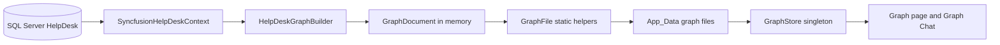
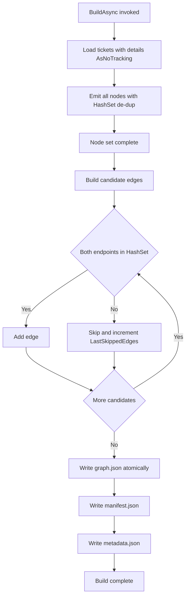
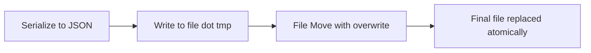
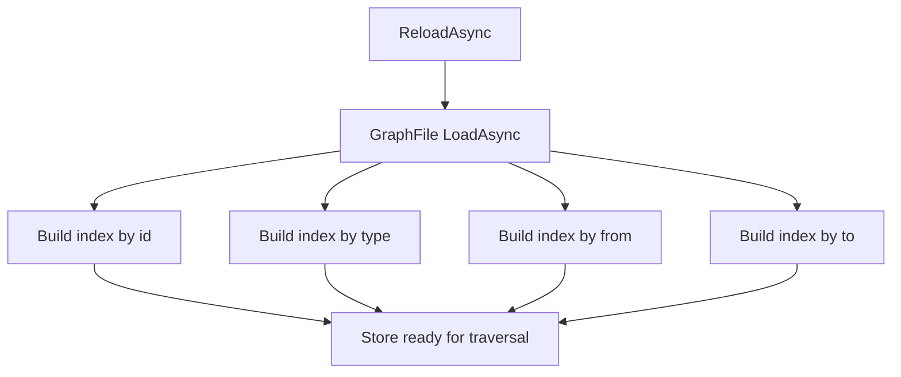
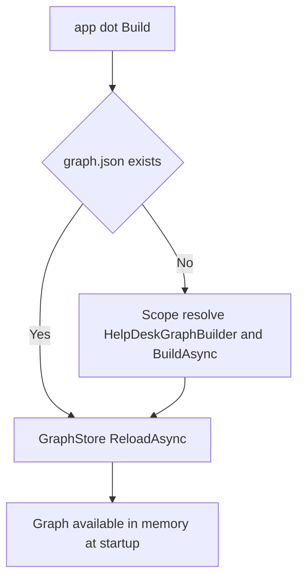

# File-Based Knowledge Graph Storage Layer

## 1. Overview

This plan describes a deterministic, file-based storage layer that derives a
knowledge graph from the live **SyncfusionHelpDesk** help-desk database and
persists it as human-readable JSON under `App_Data/graph`. The application is an
existing ASP.NET Core Blazor Server help desk. Tickets are stored in SQL Server
through Entity Framework Core using `SyncfusionHelpDeskContext`.

No graph engine or graph database is introduced. The graph is a plain object
model made of three small C# classes, serialized to JSON. This storage layer
comes first because the later Cytoscape visualization and AI chat features both
read from these files.

Key goals:

- Derive nodes and edges from the SQL Server database deterministically.
- Persist to indented, camelCase JSON that a human can read and diff.
- Guarantee stable IDs across rebuilds.
- Never corrupt `graph.json`, even if a write is interrupted.
- Build `graph.json` automatically on start-up when it does not already exist,
  so the application always has a graph to load.
- Provide a fast in-memory view (`GraphStore`) with O(1) traversal indexes.

### Source Data Model

The two source entities (already present in `Models/`):

| Entity | Properties |
| --- | --- |
| `HelpDeskTicket` | `Id`, `TicketStatus`, `TicketDate`, `TicketDescription`, `TicketRequesterEmail`, `TicketGuid`, `HelpDeskTicketDetails` |
| `HelpDeskTicketDetail` | `Id`, `HelpDeskTicketId`, `TicketDetailDate`, `TicketDescription`, `HelpDeskTicket` |

## 2. System Structure



## 3. Graph Schema

### 3.1 ID Rules

- Every node ID is lowercase.
- Every node ID is stable across rebuilds (derived from stable source keys).
- Every node ID follows the pattern `<type>:<key>`.
- Node type names use PascalCase.
- Edge type names use UPPER_SNAKE_CASE.

### 3.2 Node Schema

| Node label | Source | Key properties |
| --- | --- | --- |
| Ticket | `HelpDeskTicket` | ID `ticket:<n>`; `Label` is first 60 chars of `TicketDescription`; `Data` = `status`, `ticketDate`, `requesterEmail`, `ticketGuid` |
| TicketDetail | `HelpDeskTicketDetail` | ID `detail:<n>`; `Data` = `ticketDetailDate`, `snippet` (first 200 chars of `TicketDescription`) |
| Requester | `HelpDeskTicket.TicketRequesterEmail` | ID `requester:<email>`; one node per distinct email (case-insensitive) |
| Status | `HelpDeskTicket.TicketStatus` | ID `status:<status>`; one node per distinct status (case-insensitive) |
| Day | ticket/detail dates | ID `day:<yyyy-MM-dd>`; one node per distinct calendar day found on any ticket or ticket detail |

Node rules:

- Requester and Status use case-insensitive de-duplication; the ID uses the
  lowercased email/status text.
- Day nodes are created for every distinct calendar day seen on either a
  `TicketDate` or a `TicketDetailDate`.
- All nodes above are database-derived and are **read-only**. They must never be
  created, modified, or deleted outside of a full rebuild.

### 3.3 Edge Schema

| Edge label | From -> To | Meaning |
| --- | --- | --- |
| REQUESTED_BY | Ticket -> Requester | The ticket was opened by that requester email |
| HAS_DETAIL | Ticket -> TicketDetail | The ticket has this detail/comment; edge `Data` carries `detailDate` |
| HAS_STATUS | Ticket -> Status | The ticket currently has this status |
| OCCURRED_ON | Ticket or TicketDetail -> Day | The ticket or detail occurred on that calendar day; edge `Data` carries the relevant date |

Edge rules:

- An edge may only be emitted when **both endpoints already exist** in the node
  set. Otherwise, the edge is skipped and counted.
- Endpoint existence is validated against a `HashSet<string>` of emitted node
  IDs.
- Skipped edges are reported through `LastSkippedEdges`.

## 4. C# Data Model (three classes)

No graph engine is added; the graph is these three plain classes.

```csharp
public sealed class GraphDocument
{
    public int Version { get; set; } = 1;
    public DateTime GeneratedUtc { get; set; } = DateTime.UtcNow;
    public List<GraphNode> Nodes { get; set; } = new();
    public List<GraphEdge> Edges { get; set; } = new();
}

public sealed class GraphNode
{
    public string Id { get; set; } = "";        // e.g. "ticket:42"
    public string Type { get; set; } = "";       // e.g. "Ticket"
    public string Label { get; set; } = "";      // display text
    public Dictionary<string, object?> Data { get; set; } = new();
}

public sealed class GraphEdge
{
    public string From { get; set; } = "";       // node id
    public string To { get; set; } = "";         // node id
    public string Type { get; set; } = "";        // e.g. "REQUESTED_BY"
    public Dictionary<string, object?> Data { get; set; } = new();
}
```

## 5. Files Under App_Data/graph

| File | Contents |
| --- | --- |
| `graph.json` | The serialized `GraphDocument` (all nodes and edges) |
| `manifest.json` | Lightweight node and edge counts grouped by type, plus `LastBuildUtc` and `LastMutationUtc` |
| `metadata.json` | A description of the domain plus glossaries for node and edge labels |
| `audit.log` | Append-only log; unused here but consumed by the later mutation feature |

All JSON is written **indented** with **camelCase** property names
(`JsonSerializerOptions { WriteIndented = true, PropertyNamingPolicy = CamelCase }`).

## 6. HelpDeskGraphBuilder

Responsible for reading the database and producing the three JSON files.

- Injected with `IDbContextFactory<SyncfusionHelpDeskContext>`, `IOptions<GraphOptions>`,
  and `IWebHostEnvironment`.
- Queries with `AsNoTracking()` and `Include(t => t.HelpDeskTicketDetails)`.
- Exposes `Task<GraphDocument> BuildAsync(CancellationToken)` and a
  `LastSkippedEdges` build-report property.

### 6.1 BuildAsync Algorithm

The builder must emit **all nodes before any edges**.

1. Create a `CreateDbContextAsync()` context and load all tickets with details
   using `AsNoTracking()`.
2. Initialize an empty `GraphDocument` and a `HashSet<string> nodeIds`.
3. For each ticket, add a Requester node (`requester:<email>`), de-duplicated
   case-insensitively through the HashSet.
4. For each ticket, add a Ticket node (`ticket:<Id>`) and a TicketDetail node
   (`detail:<Id>`) for each of its details.
5. For each ticket, add its Day nodes (`day:<yyyy-MM-dd>`) for the ticket date and
   every detail date, and a Status node (`status:<status>`), all de-duplicated
   through the HashSet. Nodes are now complete.
6. For each ticket, prepare candidate edges REQUESTED_BY, HAS_STATUS,
   OCCURRED_ON, and one HAS_DETAIL/OCCURRED_ON per detail.
7. For each candidate edge, validate that both `From` and `To` exist in
   `nodeIds`. If both exist, add the edge; otherwise skip it and increment the
   skipped count.
8. Store the skipped count in `LastSkippedEdges` and set
   `GeneratedUtc = DateTime.UtcNow`.
9. Write `graph.json` via `GraphFile.SaveAtomicAsync`.
10. Write `manifest.json` via `GraphFile.WriteManifestAsync` (counts by type plus
    `LastBuildUtc`).
11. Write `metadata.json` via `GraphFile.WriteMetadataAsync`.



## 7. GraphFile (static helpers)

Static class providing path resolution, loading, and **atomic** writes. It also
holds the file-name constants (`GraphFileName`, `ManifestFileName`,
`MetadataFileName`) and the shared `JsonSerializerOptions`.

- `string ResolveDirectory(outputPath, contentRoot)` and
  `string ResolvePath(outputPath, contentRoot)` resolve the graph directory and
  the full path to `graph.json`.
- `Task<GraphDocument> LoadAsync(fullFilePath, ...)` reads and deserializes
  `graph.json`, returning an empty `GraphDocument` when the file does not exist.
- `Task SaveAtomicAsync(GraphDocument, fullFilePath, ...)` and the generic
  `Task SaveJsonAtomicAsync<T>(value, fullFilePath, ...)` serialize and write
  atomically.
- `Task WriteManifestAsync(...)` and `Task WriteMetadataAsync(...)` build and
  write the sibling manifest and metadata files.

### 7.1 Atomic Write

Every write is atomic so an interrupted write cannot corrupt `graph.json`:

1. Serialize the object to indented, camelCase JSON.
2. Write the bytes to a sibling `<file>.tmp`.
3. Complete with `File.Move(tmpPath, finalPath, overwrite: true)`.

Because `File.Move` with overwrite is atomic on the same volume, readers always
see either the old complete file or the new complete file, never a partial one.



## 8. GraphOptions

- Binds to the `"Graph"` configuration section.
- `OutputPath` defaults to `App_Data/graph`.
- Paths to the individual files are computed from `OutputPath` by `GraphFile`.

## 9. GraphStore (singleton in-memory view)

Provides a fast, read-only, in-memory view of `graph.json` with traversal
indexes so lookups are O(1) followed by a short walk.

When loaded, it builds four indexes:

- by node ID (`Dictionary<string, GraphNode>`)
- by node type (`ILookup<string, GraphNode>`)
- by edge `From` value (`ILookup<string, GraphEdge>`)
- by edge `To` value (`ILookup<string, GraphEdge>`)

Public API:

| Member | Behavior |
| --- | --- |
| `Nodes` / `Edges` / `GeneratedUtc` | The loaded document's nodes, edges, and build time |
| `GetNode(id)` | Returns the node by ID or null |
| `NodesOfType(type)` | Returns all nodes of a type |
| `OutEdges(id)` | Edges whose `From` equals the id |
| `InEdges(id)` | Edges whose `To` equals the id |
| `NodeTypes` | Distinct node types present |
| `ReloadAsync()` | Reads the latest `graph.json` and rebuilds all indexes |
| `SetDocument(doc)` | Replaces the in-memory document and reindexes (used after a mutation) |



## 10. Program.cs Wiring

- Bind `GraphOptions` from the `"Graph"` section:
  `builder.Services.Configure<GraphOptions>(builder.Configuration.GetSection("Graph"));`
- Register `HelpDeskGraphBuilder` as **scoped**.
- Register `GraphStore` as a **singleton**.
- Create the configured output directory during startup:
  `Directory.CreateDirectory(Path.Combine(ContentRootPath, graphPath))` where
  `graphPath = Configuration["Graph:OutputPath"] ?? "App_Data/graph"`.
- After `app.Build()`, **build `graph.json` on start-up when it does not already
  exist**: resolve the graph path with `GraphFile.ResolvePath`, and if the file
  is missing, create a scope, resolve `HelpDeskGraphBuilder`, and call
  `BuildAsync()` to seed it from the database.
- Then resolve `GraphStore` and call `ReloadAsync()` once so the snapshot (the
  one just built, or an existing one) is loaded into memory immediately.



## 11. Acceptance Criteria

- On first start-up, when no `graph.json` exists, the application builds it
  automatically before serving requests; on later start-ups it loads the existing
  file without rebuilding.
- Running `BuildAsync` produces `graph.json`, `manifest.json`, and
  `metadata.json` under `App_Data/graph`.
- Node IDs are lowercase, follow `<type>:<key>`, and are identical between two
  successive rebuilds of unchanged data.
- All nodes appear in the document before any edge.
- No edge exists whose endpoints are missing from the node set; every skipped
  edge is counted in `LastSkippedEdges`.
- Requester and Status nodes are de-duplicated case-insensitively.
- A Day node exists for each distinct calendar day across tickets and details.
- Interrupting a write never leaves a corrupt `graph.json` (temp-then-move).
- `GraphStore` returns correct `OutEdges`/`InEdges` and reloads on demand.
- All database-derived nodes remain read-only.
