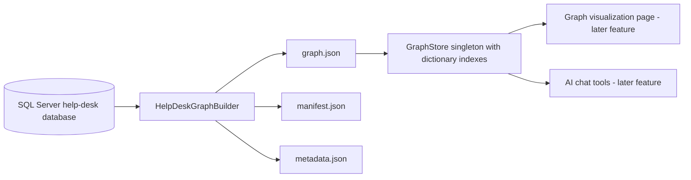
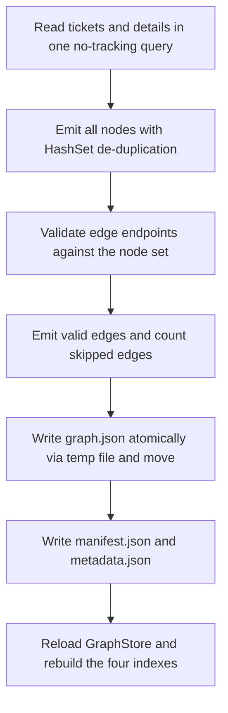

# Knowledge Graph Text Files Implementation Plan

## 1. Overview

This plan adds a file-based knowledge graph to the SyncfusionHelpDesk application. The graph is derived from the existing SQL Server help-desk database (`HelpDeskTickets` and `HelpDeskTicketDetails`, exposed through `SyncfusionHelpDeskContext`) and persisted as human-readable JSON text files under `App_Data/graph`. No graph database and no third-party graph library is used: the entire format is three small C# classes plus deterministic build code. Every later feature (the Cytoscape visualization page and the AI chat) reads from these files, so this layer is built first.

## 2. Deliverables

| File | Purpose |
|---|---|
| `specs/entities.md` | Node-type specification (authored, reviewed, committed) |
| `specs/edges.md` | Edge-type specification |
| `Models/GraphModels.cs` | `GraphDocument`, `GraphNode`, `GraphEdge` |
| `Services/Graph/GraphOptions.cs` | Binds the `Graph` configuration section |
| `Services/Graph/GraphFile.cs` | Atomic writes, path resolution, load, manifest and metadata writers |
| `Services/Graph/HelpDeskGraphBuilder.cs` | Builds the graph from the database |
| `Services/Graph/GraphStore.cs` | Singleton in-memory store with four dictionary indexes |
| `Program.cs` (edit) | DI registration, output-directory creation, initial load |
| `appsettings.json` (edit) | `"Graph": { "OutputPath": "App_Data/graph" }` |

## 3. System Structure



## 4. Schema Specification

Author two Markdown spec files under a `specs/` folder at the solution root. They are the reviewable source of truth for the graph schema.

### 4.1 Node types (`specs/entities.md`)

Node id convention: `<type>:<key>`, lowercased. Ids must be stable: rebuilding the graph from unchanged data must produce identical ids.

| Node label | Id format | Source | Key properties |
|---|---|---|---|
| Ticket | `ticket:<n>` | HelpDeskTickets | status, ticketDate, requesterEmail, ticketGuid |
| TicketDetail | `detail:<n>` | HelpDeskTicketDetails | ticketDetailDate, snippet (first 200 chars of the detail text) |
| Requester | `requester:<email>` | one per distinct case-insensitive TicketRequesterEmail | email |
| Status | `status:<status>` | one per distinct case-insensitive TicketStatus | status |
| Day | `day:<yyyy-MM-dd>` | one per distinct calendar day on a ticket or detail | date |

Additional rules to state in the spec:

- The `Ticket` node label (display text) is the first 60 characters of the ticket description.
- `Requester` and `Status` keys are lowercased before forming the id, so casing differences in the database collapse to one node.
- Database-derived nodes are rebuilt from the database and are read-only.

### 4.2 Edge types (`specs/edges.md`)

| Edge label | From -> To | Meaning | Edge data |
|---|---|---|---|
| REQUESTED_BY | Ticket -> Requester | Who opened the ticket | (none) |
| HAS_DETAIL | Ticket -> TicketDetail | A work-log entry on the ticket | detailDate |
| HAS_STATUS | Ticket -> Status | The ticket's current status | (none) |
| OCCURRED_ON | Ticket -> Day | The day the ticket was opened | date |
| OCCURRED_ON | TicketDetail -> Day | The day the detail was logged | date |

Rules to state in the spec:

- Node labels use PascalCase; edge labels use UPPER_SNAKE_CASE.
- Both endpoints of an edge must exist as nodes; otherwise the edge is skipped and counted in the build report.

## 5. Graph Data Model

Three classes and nothing else. Place them in `Models/GraphModels.cs`.

```csharp
public sealed class GraphDocument
{
    public int Version { get; set; } = 1;
    public DateTime GeneratedUtc { get; set; } = DateTime.UtcNow;
    public List<GraphNode> Nodes { get; set; } = new();
    public List<GraphEdge> Edges { get; set; } = new();
}

public sealed class GraphNode
{
    public string Id { get; set; } = "";        // e.g. "ticket:42"
    public string Type { get; set; } = "";      // e.g. "Ticket"
    public string Label { get; set; } = "";     // display text
    public Dictionary<string, object?> Data { get; set; } = new();
}

public sealed class GraphEdge
{
    public string From { get; set; } = "";      // node id
    public string To { get; set; } = "";        // node id
    public string Type { get; set; } = "";      // e.g. "REQUESTED_BY"
    public Dictionary<string, object?> Data { get; set; } = new();
}
```

## 6. On-Disk Files

All files are written under the configured output directory (default `App_Data/graph`). Serialize with a camelCase JSON naming policy and indented output so the files stay diffable and human-readable.

| File | Contents |
|---|---|
| `graph.json` | The serialized `GraphDocument` (nodes + edges) |
| `manifest.json` | Node and edge counts by type, `lastBuildUtc`, `lastMutationUtc` |
| `metadata.json` | Domain description plus a node-label and edge-label glossary |
| `audit.log` | Append-only log; reserved now, used when mutations are added later |

Example `manifest.json` shape:

```json
{
  "version": 1,
  "lastBuildUtc": "2026-07-12T00:00:00Z",
  "lastMutationUtc": null,
  "nodeCounts": { "Ticket": 0, "TicketDetail": 0, "Requester": 0, "Status": 0, "Day": 0 },
  "edgeCounts": { "REQUESTED_BY": 0, "HAS_DETAIL": 0, "HAS_STATUS": 0, "OCCURRED_ON": 0 }
}
```

`metadata.json` holds one `description` string for the domain ("A help-desk knowledge graph derived from tickets, their work-log details, requesters, statuses, and calendar days") and two glossaries mapping each node label and edge label to a one-sentence meaning.

## 7. The Builder (`HelpDeskGraphBuilder`)

Registered scoped. Dependencies: `IDbContextFactory<SyncfusionHelpDeskContext>`, `IOptions<GraphOptions>`, `IWebHostEnvironment`.

Build algorithm (`BuildAsync`):

1. Create a context from the factory; query `HelpDeskTickets` once with `Include(t => t.HelpDeskTicketDetails)` and `AsNoTracking()`.
2. Emit ALL nodes before ANY edges. Build Requester nodes (one per distinct lowercased email), Ticket nodes, TicketDetail nodes, Status nodes (one per distinct lowercased status), and Day nodes (one per distinct calendar day on a ticket or detail). De-duplicate by id with a `HashSet<string>`; the first emission wins.
3. Emit edges (`REQUESTED_BY`, `HAS_STATUS`, `HAS_DETAIL`, `OCCURRED_ON` for both ticket and detail dates), validating both `From` and `To` against the node-id set. Any edge with a missing endpoint is skipped, and the count is tracked in a public `LastSkippedEdges` property as the build report.
4. Set `GeneratedUtc`, then write `graph.json` atomically and write `manifest.json` and `metadata.json` through `GraphFile`.
5. Return the built `GraphDocument`; the caller decides when to reload `GraphStore`.

## 8. GraphFile (Atomic Writes and Paths)

Static helper class. Constants: `GraphFileName = "graph.json"`, `ManifestFileName = "manifest.json"`, `MetadataFileName = "metadata.json"`, `AuditFileName = "audit.log"`.

- `ResolveDirectory(outputPath, contentRootPath)`: returns the absolute output directory, treating a relative `OutputPath` as relative to the content root.
- `SaveAtomicAsync(doc, path, ct)`: serialize to `<path>.tmp`, then `File.Move(tmp, path, overwrite: true)`. A crash mid-write can therefore never corrupt `graph.json`, because the destination is replaced only by a completed file.
- `LoadAsync(path, ct)`: deserialize a `GraphDocument`, returning an empty document when the file does not exist.
- `WriteManifestAsync(doc, dir, lastMutationUtc, ct)`: compute counts by type and write `manifest.json` (atomically, same pattern).
- `WriteMetadataAsync(doc, dir, ct)`: write the domain description and label glossaries.

## 9. GraphOptions

```csharp
public sealed class GraphOptions
{
    public string OutputPath { get; set; } = "App_Data/graph";
}
```

Bound from the `"Graph"` configuration section.

## 10. GraphStore (Load and Index)

A singleton that loads `graph.json` and builds four indexes so every traversal is an O(1) lookup plus a short walk:

- nodes by id (`Dictionary<string, GraphNode>`)
- nodes by type (`Dictionary<string, List<GraphNode>>`)
- outgoing edges keyed by `From` (`Dictionary<string, List<GraphEdge>>`)
- incoming edges keyed by `To` (`Dictionary<string, List<GraphEdge>>`)

Public API: `Nodes`, `Edges`, `GetNode(id)`, `NodesOfType(type)`, `OutEdges(id)`, `InEdges(id)`, `NodeTypes`, and `ReloadAsync()` which re-reads `graph.json` and rebuilds all four indexes. Build the new indexes fully, then swap the references, so readers never observe a half-built index.

## 11. Dependency Injection and Startup (`Program.cs`)

- `builder.Services.Configure<GraphOptions>(builder.Configuration.GetSection("Graph"));`
- Register `HelpDeskGraphBuilder` (scoped) and `GraphStore` (singleton).
- At startup: resolve the output directory, `Directory.CreateDirectory` it, and call `GraphStore.ReloadAsync()` once so any existing snapshot loads into memory before the first page renders.

## 12. Process Flow: Building the Graph



## 13. Acceptance Criteria

- Rebuilding the graph produces identical ids for unchanged data.
- `graph.json`, `manifest.json`, and `metadata.json` are all written on every build.
- Edges with a missing endpoint are skipped and reflected in the skipped-edge count.
- Database-derived nodes are treated as read-only.
