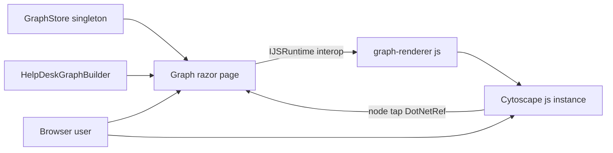
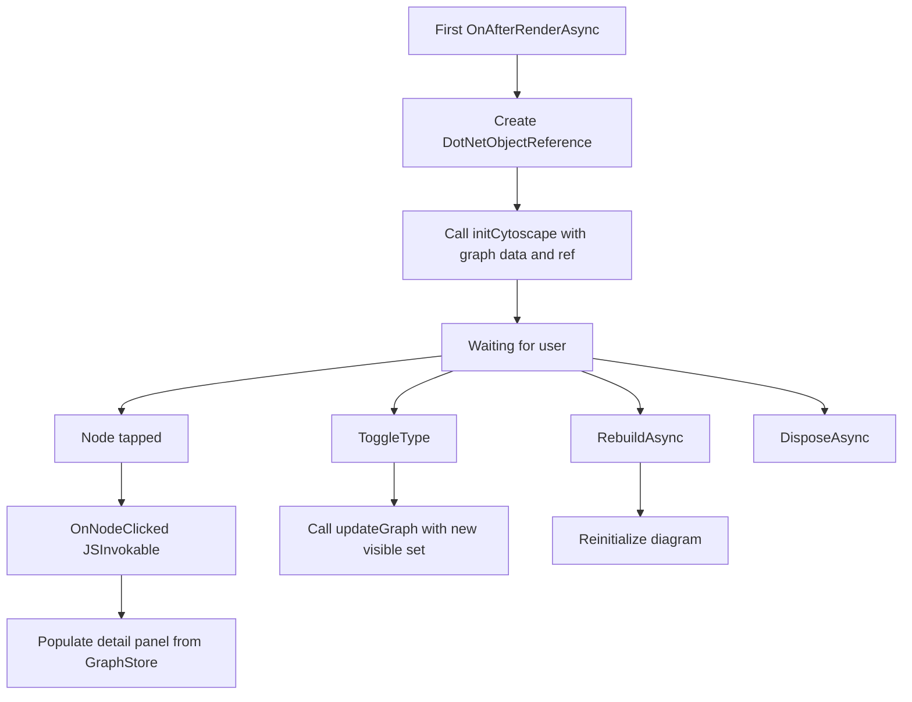

# Interactive Knowledge Graph Explorer

## 1. Overview

This plan describes an interactive knowledge graph explorer implemented in
`Components/Pages/Graph.razor`. By this stage the file-based graph is already
loaded into a singleton `GraphStore`, and `HelpDeskGraphBuilder` and
`GraphStore` are registered in dependency injection. The graph contains
**Ticket**, **TicketDetail**, **Requester**, **Status**, and **Day** nodes,
connected by **REQUESTED_BY**, **HAS_DETAIL**, **HAS_STATUS**, and
**OCCURRED_ON** edges.

The page renders the graph in the browser with **Cytoscape.js** through
JavaScript interop. A user can:

- Filter node types with checkboxes.
- Select a node to inspect its properties and neighbors.
- Toggle full-screen mode.
- Rebuild the graph from the current database without reloading the page.

## 2. System Structure



## 3. Browser-Side Integration

Place the browser integration in `wwwroot/js/graph-renderer.js`. Cytoscape.js is
served as `wwwroot/js/cytoscape.min.js` and referenced by the application host
(`Components/App.razor`) with a `<script>` tag, followed by the module or script
tag for `graph-renderer.js`.

### 3.1 Exported Interop Contract

The renderer exports exactly four functions for Blazor to call.

| Function | Parameters | Purpose |
| --- | --- | --- |
| `initCytoscape` | `containerId`, `graphData`, `dotNetRef` | Create the Cytoscape instance in the container, apply styles and the cose layout, register tap handlers, and keep the `.NET` reference for callbacks |
| `updateGraph` | `containerId`, `graphData` | Replace elements on the existing instance and re-run the cose layout without recreating Cytoscape |
| `destroyCytoscape` | `containerId` | Destroy the instance and release the stored `.NET` reference |
| `toggleFullScreen` | `containerId` | Toggle the container in and out of browser full-screen mode |

### 3.2 Tap Handlers

- During `initCytoscape`, register a **node** tap handler that invokes
  `OnNodeClicked` on the `.NET` reference, passing the tapped node's id.
- Register a **background** tap handler that clears the current selection
  (unselects elements and calls back to close the detail panel, or simply
  unselects on the JS side).

### 3.3 Node Styling by Type

Each node type has a recognizable color and shape.

| Node type | Color | Shape |
| --- | --- | --- |
| Ticket | Blue `#4e79a7` | round-rectangle |
| TicketDetail | Green `#59a14f` | ellipse |
| Requester | Red `#e15759` | ellipse |
| Status | Orange `#f28e2b` | diamond |
| Day | Teal `#76b7b2` | rectangle |

Style selectors use `node[type = "Ticket"]` etc., mapping `background-color`,
`shape`, and a `label` of `data(label)`.

### 3.4 Edge Styling and Layout

- Edges are drawn with **visible labels** (`label: data(label)`),
  **arrowheads** (`target-arrow-shape: triangle`), and **bezier** curves
  (`curve-style: bezier`).
- Selected elements get a distinct `:selected` style (for example a thicker
  border and highlight color) so the current selection is obvious.
- Layout uses Cytoscape's animated **cose** force-directed layout
  (`{ name: 'cose', animate: true }`), applied on init and re-run after
  `updateGraph`.

## 4. Graph.razor Page

Directives and injections:

- `@page "/graph"`
- `@rendermode InteractiveServer`
- `@implements IAsyncDisposable`
- `@inject IJSRuntime JS`
- `@inject GraphStore Store`
- `@inject HelpDeskGraphBuilder Builder`

### 4.1 Toolbar

- A **Rebuild Graph** button, disabled while a rebuild is in progress.
- Badges showing node and edge counts.
- The graph's generated timestamp (`GeneratedUtc`).
- A **Full Screen** toggle button.

### 4.2 Entity-Type Checkboxes

- Build one checkbox per type from `GraphStore.NodeTypes`.
- Initially show the connected core of **Ticket**, **Requester**, and
  **Status**; leave **TicketDetail** and **Day** available to enable when
  needed.
- If none of those default core types exist, show every available type instead.

### 4.3 Graph Viewport and Detail Panel

- The graph lives in a viewport-sized `<div id="cy">`.
- When a node is selected, a detail panel shows the node's label, type, every
  `Data` property, and its connected nodes together with each relationship
  label.

## 5. Data Shaping and Interop Lifecycle

### 5.1 BuildGraphData

`BuildGraphData()` produces the renderer's expected shape:

```json
{
  "nodes": [{ "id": "", "label": "", "type": "" }],
  "edges": [{ "id": "", "source": "", "target": "", "label": "" }]
}
```

Rules:

- Include only nodes whose type is currently visible.
- Include an edge **only when both** of its endpoints are visible.
- Edge `id` is synthesized (for example `source + "_" + type + "_" + target`);
  `label` is the edge type.

### 5.2 Lifecycle



- On the **first** `OnAfterRenderAsync`, create a `DotNetObjectReference<Graph>`
  and pass it to `initCytoscape`.
- `OnNodeClicked(string nodeId)` is marked `[JSInvokable]`. It retrieves the
  node from `GraphStore.GetNode`, populates the detail panel, and collects
  neighbors from both `GraphStore.OutEdges` and `GraphStore.InEdges`, resolving
  the other endpoint node for each and recording the relationship label. Call
  `StateHasChanged()` afterward.
- `ToggleType(type)` updates the visible set, closes the detail panel, and calls
  `updateGraph` (it must not re-run `initCytoscape`).
- `RebuildAsync()` sets a busy flag, calls `HelpDeskGraphBuilder.BuildAsync`,
  then `GraphStore.ReloadAsync`, refreshes the available types, reinitializes
  the diagram, and clears the busy flag.
- `DisposeAsync()` calls `destroyCytoscape` and disposes the
  `DotNetObjectReference`, ignoring `JSDisconnectedException` if the Blazor
  circuit has already ended.

## 6. Program.cs Configuration

Large graphs can create large interop messages. Raise
`HubOptions.MaximumReceiveMessageSize` through the interactive server component
options so SignalR does not drop the circuit:

```csharp
builder.Services.AddRazorComponents()
    .AddInteractiveServerComponents()
    .AddHubOptions(options =>
    {
        options.MaximumReceiveMessageSize = 10 * 1024 * 1024; // 10 MB
    });
```

`MaximumReceiveMessageSize` lives on `HubOptions`, not on `CircuitOptions`, so it
must be set through `AddHubOptions` chained after `AddInteractiveServerComponents`.

`HelpDeskGraphBuilder` (scoped) and `GraphStore` (singleton) are already
registered from the storage-layer plan and are injected into the page.

## 7. Main-Menu Integration (the sidebar link MUST render)

Add the link in `Components/Layout/NavMenu.razor`, inside the `<Authorized>` block:

```razor
<div class="nav-item px-3">
    <NavLink class="nav-link" href="graph">
        <span class="bi bi-diagram-3-fill-nav-menu" aria-hidden="true"></span> Knowledge Graph
    </NavLink>
</div>
```

CRITICAL: this project does **not** load the Bootstrap Icons web font. The sidebar
glyphs are inline SVG data-URI background images defined in
`Components/Layout/NavMenu.razor.css`, so a `bi` class with no matching rule there
renders as an empty box. Add a matching `.bi-diagram-3-fill-nav-menu` rule: copy an
existing icon rule in that file as a template and replace its SVG markup with the
official Bootstrap Icons "diagram-3-fill" SVG, URL-encoded, so the icon is
self-contained.

Rule of thumb: never emit a `<span class="bi bi-...">` without adding its matching
data-URI class in `NavMenu.razor.css`, and never assume a Bootstrap Icons font is
loaded.

## 8. Acceptance Criteria

- Navigating to `/graph` renders the graph with Cytoscape using the cose layout.
- Each node type shows its designated color and shape (Ticket blue
  round-rectangle, TicketDetail green ellipse, Requester red ellipse, Status
  orange diamond, Day teal rectangle).
- Edges show labels, arrowheads, and bezier curves; selection has a distinct
  `:selected` style.
- Type checkboxes derive from `GraphStore.NodeTypes`; the initial view shows the
  Ticket/Requester/Status core, or all types if that core is absent.
- Toggling a type calls `updateGraph` (no full re-init) and an edge appears only
  when both endpoints are visible.
- Tapping a node opens the detail panel with label, type, all `Data`
  properties, and connected nodes with relationship labels; tapping the
  background clears the selection.
- Rebuild Graph rebuilds from the database, reloads the store, and refreshes the
  diagram without a page reload, and is disabled while running.
- Full Screen toggles the viewport in and out of full-screen.
- Disposing the page destroys Cytoscape and the `.NET` reference without
  throwing on a disconnected circuit.
- The Knowledge Graph link appears in the sidebar for an authorized user with a
  visible graph icon (not an empty box), because a matching
  `.bi-diagram-3-fill-nav-menu` rule exists in `NavMenu.razor.css`.
