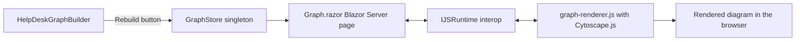
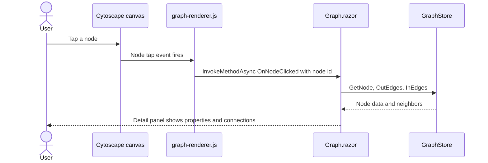
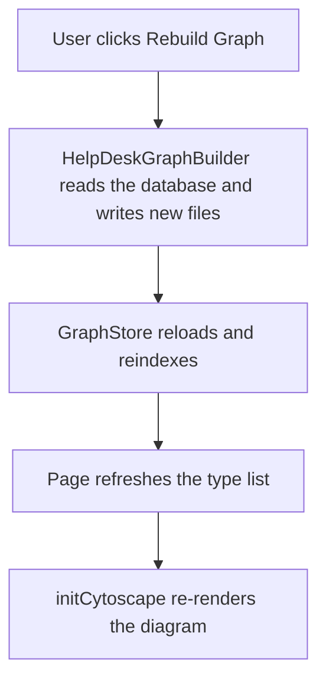

# Knowledge Graph Visualization Page Implementation Plan

## 1. Overview

This plan adds an interactive graph explorer at route `/graph`. The page draws the knowledge graph already loaded into the singleton `GraphStore` (node types Ticket, TicketDetail, Requester, Status, Day; edges REQUESTED_BY, HAS_DETAIL, HAS_STATUS, OCCURRED_ON) using Cytoscape.js through JavaScript interop. The user can filter by node type, click a node to inspect its properties and neighbors, and rebuild the graph from the current database, all without a page reload. `GraphStore` and `HelpDeskGraphBuilder` already exist and are registered in DI.

## 2. Deliverables

| File | Purpose |
|---|---|
| `wwwroot/js/cytoscape.min.js` | The Cytoscape.js library |
| `wwwroot/js/graph-renderer.js` | Style map, layout, and the interop surface |
| `Components/Pages/Graph.razor` | The Blazor Server page at `/graph` |
| `Components/App.razor` (edit) | Script references for both JS files |
| `Program.cs` (edit) | Raise the SignalR maximum receive message size |
| `Components/Layout/NavMenu.razor` (edit) | Sidebar link inside the `<Authorized>` block |
| `Components/Layout/NavMenu.razor.css` (edit) | Inline SVG data-URI icon class for the link |

## 3. System Structure



## 4. The JavaScript Renderer (`wwwroot/js/graph-renderer.js`)

### 4.1 Exported functions (the interop contract)

| Function | Behavior |
|---|---|
| `initCytoscape(containerId, graphData, dotNetRef)` | Creates the Cytoscape instance, applies styles and the layout, wires a node tap handler that calls `dotNetRef.invokeMethodAsync('OnNodeClicked', nodeId)` and a background tap that clears the selection (invokes `OnNodeClicked` with null) |
| `updateGraph(containerId, graphData)` | Replaces the elements of the existing instance and re-runs the layout without re-initializing |
| `destroyCytoscape(containerId)` | Destroys the instance and releases its resources |
| `toggleFullScreen(containerId)` | Toggles the container in and out of browser full-screen mode |

Keep instances in a module-level map keyed by `containerId` so the functions are safe to call in any order.

### 4.2 Node styling by type

| Node type | Color | Shape |
|---|---|---|
| Ticket | blue `#4e79a7` | round-rectangle |
| TicketDetail | green `#59a14f` | ellipse |
| Requester | red `#e15759` | ellipse |
| Status | orange `#f28e2b` | diamond |
| Day | teal `#76b7b2` | rectangle |

### 4.3 Edge styling and layout

- Edges show their type as a label, with a target arrowhead and `curve-style: bezier`.
- Provide a `:selected` style for nodes and edges (thicker border, highlight color).
- Layout: `cose` (force-directed) with animation enabled, so related nodes settle into readable clusters without manual positioning.

## 5. The Blazor Page (`Components/Pages/Graph.razor`)

- Directives: `@page "/graph"`, `@rendermode InteractiveServer`, `@implements IAsyncDisposable`.
- Injections: `IJSRuntime`, `GraphStore`, `HelpDeskGraphBuilder`.
- Toolbar: a Rebuild Graph button (disabled while a build is running), badges showing node and edge counts, the `GeneratedUtc` timestamp, and a Full Screen toggle.
- Entity-type filter: a row of "Show:" checkboxes built from `GraphStore.NodeTypes`. Default the visible set to the connected core (Ticket + Requester + Status) and let the user toggle the busier types (TicketDetail, Day) on. If none of the default types are present in the store, fall back to showing all types.
- A `#cy` container `div` sized to the viewport (e.g. `height: calc(100vh - 260px)`), plus a detail panel that appears when a node is selected showing its label, type, all `Data` properties, and the list of connected nodes with the relationship label for each.

## 6. Interop and Data Shaping

- `BuildGraphData()`: project only nodes whose type is currently visible, and only edges whose both endpoints are visible, into the shape the renderer expects: `{ nodes: [{ id, label, type }], edges: [{ id, source, target, label }] }`.
- `OnAfterRenderAsync(firstRender)`: on first render, create a `DotNetObjectReference` to the page and call `initCytoscape`.
- `[JSInvokable] OnNodeClicked(nodeId)`: look the node up in `GraphStore`, populate the detail-panel state, and gather neighbors from `OutEdges` and `InEdges`; a null id clears the selection. Call `StateHasChanged` because the call arrives from JavaScript.
- `ToggleType(type)`: update the visible set, dismiss the detail panel, and call `updateGraph` with a freshly built payload.
- `RebuildAsync()`: call `HelpDeskGraphBuilder.BuildAsync()`, then `GraphStore.ReloadAsync()`, refresh the type list, and re-initialize the diagram.
- `DisposeAsync()`: call `destroyCytoscape` and dispose the `DotNetObjectReference`; swallow `JSDisconnectedException` so navigating away after the circuit is gone does not throw.

## 7. Configuration

Large graphs produce large interop payloads. In `Program.cs`, raise the SignalR hub message size limit so a big graph does not drop the circuit:

```csharp
builder.Services.AddRazorComponents()
    .AddInteractiveServerComponents()
    .AddHubOptions(options =>
    {
        options.MaximumReceiveMessageSize = 10 * 1024 * 1024;
    });
```

## 8. Main-Menu Integration (the sidebar icon MUST render)

Add the link in `Components/Layout/NavMenu.razor`, inside the `<Authorized>` block:

```html
<div class="nav-item px-3">
    <NavLink class="nav-link" href="graph">
        <span class="bi bi-diagram-3-fill-nav-menu" aria-hidden="true"></span> Knowledge Graph
    </NavLink>
</div>
```

CRITICAL: this project does NOT load the Bootstrap Icons web font. The sidebar glyphs are inline SVG data-URI background images defined in `Components/Layout/NavMenu.razor.css`; a `bi` class with no matching rule there renders as an empty box. Add a matching `.bi-diagram-3-fill-nav-menu` rule: copy an existing icon rule in that file as a template and replace its SVG markup with the official Bootstrap Icons "diagram-3-fill" SVG, URL-encoded, so the icon is self-contained (no external font or file needed).

Rule of thumb: never emit a `<span class="bi bi-...">` without adding its matching data-URI class in `NavMenu.razor.css`, and never assume a Bootstrap Icons font is loaded.

## 9. Process Flow: Clicking a Node



## 10. Process Flow: Rebuild



## 11. Acceptance Criteria

- The page renders the current graph on load and shows accurate node and edge counts.
- Toggling a node type immediately shows or hides those nodes and their edges.
- Clicking a node shows its properties and its connected nodes; clicking the background clears the selection.
- Rebuild regenerates the graph from the database and redraws without a page reload.
- Leaving the page disposes the Cytoscape instance and interop reference cleanly.
- The Knowledge Graph link appears in the sidebar with a visible graph icon (not an empty box), because a matching `.bi-diagram-3-fill-nav-menu` rule exists in `NavMenu.razor.css`.
