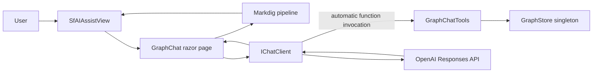
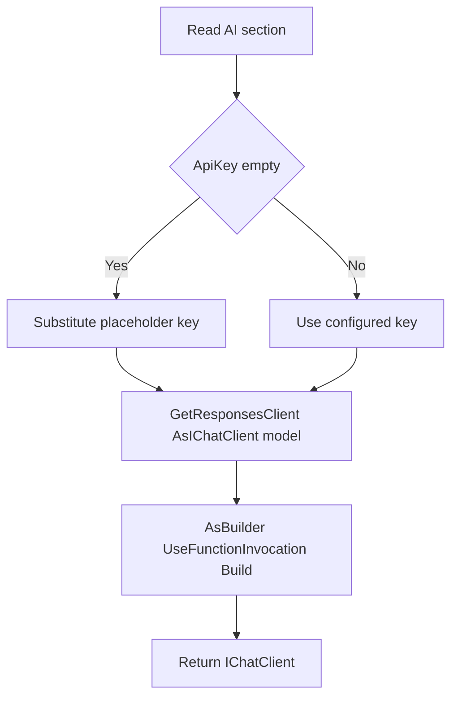
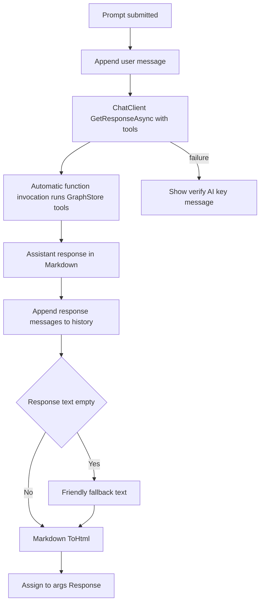

# Read-Only Graph Chat Assistant

## 1. Overview

This plan describes a read-only **Graph Chat** assistant in
`Components/Pages/GraphChat.razor`, served at `/graphchat`. The application
already has a singleton `GraphStore` containing **Ticket**, **TicketDetail**,
**Requester**, **Status**, and **Day** nodes, connected by **REQUESTED_BY**,
**HAS_DETAIL**, **HAS_STATUS**, and **OCCURRED_ON** edges.

The assistant answers relationship questions about this graph, such as:

- "How many tickets has this email opened?"
- "List the open tickets."
- "Show graph statistics."

The assistant is **strictly read-only**. Every answer is grounded in
deterministic `GraphStore` traversals exposed as tools. It must never invent
ticket IDs, email addresses, counts, statuses, or dates. The chat uses
**Microsoft.Extensions.AI** (`IChatClient` with automatic function invocation)
and Syncfusion's Blazor **SfAIAssistView** for the interface.

## 2. System Structure



## 3. ChatClientFactory

Create `Services/AI/ChatClientFactory.cs` to keep OpenAI client construction
behind `IChatClient`.

- Static `IChatClient Create(IConfiguration aiSection)`.
- Reads `ApiKey` and `Model` from the `"AI"` section, falling back to a
  `DefaultModel` constant when `Model` is absent.
- OpenAI is the only supported AI provider; there is no provider selector.
- Finishes the pipeline with
  `.AsBuilder().UseFunctionInvocation().Build()` so tool calls are handled
  automatically during a chat request.

### 3.1 Use the Responses API, not Chat Completions

The client is built from the OpenAI **Responses** endpoint:

```csharp
#pragma warning disable OPENAI001
IChatClient chatClient = new OpenAIClient(apiKey)
    .GetResponsesClient()
    .AsIChatClient(model);
#pragma warning restore OPENAI001
```

This is not a stylistic choice. Reasoning models such as the gpt-5 family
reject function tools on `/v1/chat/completions` but accept them on
`/v1/responses`. Because a tool-calling assistant is the entire point of this
feature, the Responses endpoint is required for any current model. The
Responses client is still marked experimental in the OpenAI SDK, which is why
the `OPENAI001` warning is suppressed at the call site with a comment naming
the reason.

### 3.2 Missing key is not a startup failure

A configured API key is **not** a startup requirement. When `ApiKey` is empty,
substitute a placeholder string so construction does not throw. The application
and the chat page then load normally, and the first real request fails with a
clear authentication message that the page surfaces.

### 3.3 One configuration section

The `"AI"` section is the single AI configuration for the whole application:

```json
"AI": { "ApiKey": "", "Model": "gpt-5.6-sol" }
```

There is **no** separate `"OpenAI"` section. `Program.cs` reads `AI:ApiKey` and
`AI:Model` directly to register the Syncfusion Smart Components inference
service, and only when the key is non-empty. One section feeds two consumers;
do not reintroduce a second key.



## 4. Read-Only Tool Contract

Define the contract in `Services/AI/GraphTools/IGraphChatTools.cs` and implement
it in `GraphChatTools.cs`. Every method performs a deterministic `GraphStore`
traversal and carries a `[Description]` attribute so its signature becomes the
tool schema. Any method returning a list accepts a `max` argument to keep
results from flooding the model's context window.

The `[Description]` attributes live on the **interface**, not the
implementation, so the text the model reads and the contract the code compiles
against cannot drift apart.

| Tool | Parameters | Returns | Traversal |
| --- | --- | --- | --- |
| FindRequesterByEmail | `query`, `max` | `IList<RequesterSummary>` | Scans `NodesOfType("Requester")`, case-insensitive contains on the email key |
| CountTicketsForRequester | `email` | `int` | Resolves `requester:<email>`, counts `InEdges` of type REQUESTED_BY |
| ListTicketsForRequester | `email`, `status`, `max` | `IList<TicketSummary>` | REQUESTED_BY `InEdges` of the requester, optionally filtered by the ticket's status property |
| ListDetailsForTicket | `ticketId`, `max` | `IList<CommentSummary>` | HAS_DETAIL `OutEdges` of the ticket to TicketDetail nodes |
| SearchNodes | `query`, `type`, `max` | `IList<NodeSummary>` | Filters nodes by label/id contains, optional type filter |
| GetNode | `id` | `NodeDetail` | `GraphStore.GetNode(id)` |
| GetNeighbors | `id`, `edgeType`, `max` | `IList<Neighbor>` | `OutEdges` and `InEdges` of the node, optionally filtered by edge type |
| Stats | (none) | `GraphStats` | Counts nodes by type and edges by type from `GraphStore` |

All eight tools are read-only. They return focused DTOs declared in
`Services/AI/GraphTools/GraphChatDtos.cs` (`NodeSummary`, `NodeDetail`,
`Neighbor`, `TicketSummary`, `CommentSummary`, `RequesterSummary`,
`GraphStats`) rather than raw graph nodes or database rows.

### 4.1 Tool Registration

In `Services/AI/GraphTools/GraphToolRegistration.cs`, add a static
`IList<AITool> CreateTools(IGraphChatTools tools)` that wraps every method with
`AIFunctionFactory.Create` and returns the list.

## 5. System Prompt

`Services/AI/GraphTools/GraphSystemPrompt.cs` exposes a constant `Text` prompt.
It explains the graph's node and edge types, the ID conventions
(`<type>:<key>`), and the available tools. The grounding rules instruct the
model to:

- Derive every number from tool results (never guess counts, IDs, dates, or
  statuses).
- Resolve people with `FindRequesterByEmail` **before** looking up tickets.
- Prefer purpose-built tools (for example `CountTicketsForRequester`,
  `ListTicketsForRequester`) over the generic `SearchNodes`/`GetNode` tools.
- Explicitly say when a tool returns no result.
- Keep answers concise while naming the tickets or requesters it found.

## 6. GraphChat.razor Page

- `@page "/graphchat"`, `@rendermode InteractiveServer`.
- `@inject IChatClient ChatClient`, `@inject IGraphChatTools GraphTools`.
- The whole page sits inside an `<AuthorizeView>`; an anonymous visitor sees a
  sign-in message instead of the assistant.
- Hosts an `SfAIAssistView` with several `PromptSuggestions` (for example the
  three example questions) and a `PromptRequested` handler.
- Maintains a `List<ChatMessage>` history initialized with a `System` message
  containing `GraphSystemPrompt.Text`.

### 6.1 The ChatMessage name collision

Syncfusion's `Syncfusion.Blazor.InteractiveChat` namespace also defines a
`ChatMessage` type, so an unqualified `ChatMessage` is ambiguous. Add a using
alias at the top of the page:

```razor
@using ChatMessage = Microsoft.Extensions.AI.ChatMessage
```

### 6.2 The request cycle

Per submitted prompt:

1. Append the user message to history.
2. Call `ChatClient.GetResponseAsync(history, new ChatOptions { Tools = GraphToolRegistration.CreateTools(GraphTools) })`.
3. Append `response.Messages` to history.
4. Return `response.Text` (supply a friendly fallback if the text is empty).
5. Catch request failures and tell the user to verify the OpenAI API key in the
   `"AI"` configuration section.

### 6.3 Rendering the model's Markdown

`SfAIAssistView` renders its response as HTML, but the model replies in
Markdown. Assigning the raw text shows literal asterisks and pipe characters
instead of lists and tables. Add a **Markdig** package reference and convert the
text at the moment it is handed to the component:

```csharp
private static readonly MarkdownPipeline _markdownPipeline = new MarkdownPipelineBuilder()
    .UseAdvancedExtensions()
    .Build();

private async Task PromptRequestedAsync(AssistViewPromptRequestedEventArgs args)
{
    var responseText = await GetAssistantResponseAsync(args.Prompt);
    args.Response = Markdown.ToHtml(responseText, _markdownPipeline);
}
```

Build the pipeline once as a static field rather than per request. Keep the
conversion at the very edge of the component: the chat history stores the
model's original Markdown, and only the displayed string is HTML. Separating
`PromptRequestedAsync` (presentation) from `GetAssistantResponseAsync`
(the model round trip) keeps that boundary obvious.



## 7. Navigation Link

Add a **Graph Assistant** link to the left sidebar inside the `<Authorized>`
block in `Components/Layout/NavMenu.razor`:

```razor
<div class="nav-item px-3">
    <NavLink class="nav-link" href="graphchat">
        <span class="bi bi-chat-dots-fill-nav-menu" aria-hidden="true"></span> Graph Assistant
    </NavLink>
</div>
```

Add a matching `.bi-chat-dots-fill-nav-menu` rule to `NavMenu.razor.css` (using
the same embedded-SVG background pattern as the other `.bi-*-nav-menu` rules) so
the chat icon renders instead of an empty box.

## 8. Program.cs Wiring

Register the chat client as a **singleton**:

```csharp
builder.Services.AddSingleton<IChatClient>(sp =>
    ChatClientFactory.Create(builder.Configuration.GetSection("AI")));
builder.Services.AddScoped<IGraphChatTools, GraphChatTools>();
```

> **Do not use `AddScoped` here.** The singleton lifetime is required, not
> preferred.

Syncfusion's `SyncfusionAIService` is registered as a singleton, and in ASP.NET
Core a singleton cannot consume a scoped service. Registering `IChatClient` as
scoped makes the application throw at start-up, before it serves a single page:

```text
Cannot consume scoped service 'Microsoft.Extensions.AI.IChatClient' from singleton
'Syncfusion.Blazor.SmartComponents.SyncfusionAIService'.
```

The singleton lifetime is safe because the client `ChatClientFactory.Create`
returns holds no per-request state and is thread-safe.

The general rule, which applies to anything else these AI services consume: a
singleton consumer forces every dependency it touches to be a singleton or a
transient, never a scoped service.

| Service | Lifetime | Why |
| --- | --- | --- |
| `IChatClient` | **Singleton** | Consumed by the singleton `SyncfusionAIService`; stateless and thread-safe |
| `IGraphChatTools` | Scoped | Consumed per request by the chat page only |
| `GraphStore` | Singleton | Holds the loaded graph for the process |
| `HelpDeskGraphBuilder` | Scoped | Consumes a database context |

Smart Components are wired from the same `"AI"` section, and only when a key is
present:

```csharp
var openAIApiKey = builder.Configuration["AI:ApiKey"];
if (!string.IsNullOrWhiteSpace(openAIApiKey))
{
    var openAIModel = builder.Configuration["AI:Model"] ?? "gpt-4o-mini";
    IChatClient openAIChatClient = new OpenAI.Chat.ChatClient(openAIModel, openAIApiKey)
        .AsIChatClient();

    builder.Services.AddChatClient(openAIChatClient);
    builder.Services.AddSyncfusionSmartComponents()
        .InjectOpenAIInference();
}
```

## 9. Acceptance Criteria

- Every factual statement in an answer is backed by a tool result, with no
  fabricated IDs, counts, statuses, or dates.
- A question about a person resolves the email with `FindRequesterByEmail`
  first, then reports tickets.
- "Show graph statistics" returns node and edge counts from `Stats()`.
- A reply containing a Markdown list or table renders as a real list or table,
  not as raw Markdown punctuation.
- The application starts and serves its first page without throwing a
  dependency-injection lifetime exception; `IChatClient` is resolvable by the
  singleton `SyncfusionAIService`.
- With no API key configured, the page still renders and shows a clear error
  after a prompt is submitted.
- The sidebar shows the Graph Assistant link with its chat-dots icon visibly
  rendered.
- The assistant remains strictly read-only; no tool mutates the graph.
