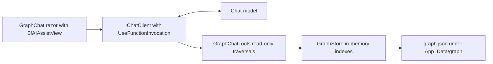
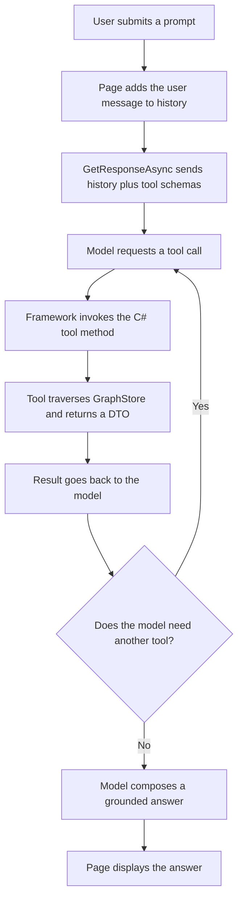

# Read-Only Graph Chat Assistant Implementation Plan

## 1. Overview

This plan adds an AI chat page at route `/graphchat` that answers natural-language relationship questions about the knowledge graph ("How many tickets has this email opened?", "List the open tickets", "Show graph statistics"). The assistant is strictly read-only: it answers ONLY from deterministic graph traversals exposed as tools, and never invents ticket numbers, emails, counts, statuses, or dates. It uses the `Microsoft.Extensions.AI` abstractions (`IChatClient` with automatic function/tool invocation) and the Syncfusion Blazor AI AssistView (`SfAIAssistView`) for the UI.

## 2. Deliverables

| File | Purpose |
|---|---|
| `Services/AI/ChatClientFactory.cs` | Provider-agnostic `IChatClient` construction |
| `Services/AI/GraphTools/IGraphChatTools.cs` | The read-only tool contract |
| `Services/AI/GraphTools/GraphChatTools.cs` | Tool implementation over `GraphStore` |
| `Services/AI/GraphTools/GraphToolRegistration.cs` | Wraps the tools with `AIFunctionFactory` |
| `Services/AI/GraphTools/GraphSystemPrompt.cs` | The system prompt constant |
| `Components/Pages/GraphChat.razor` | The chat page |
| `Program.cs` (edit) | DI registration |
| `appsettings.json` (edit) | The `"AI"` configuration section |
| `Components/Layout/NavMenu.razor` + `.css` (edit) | Sidebar link and icon |

## 3. System Structure



## 4. The Provider-Agnostic Chat Client (`ChatClientFactory`)

- A static `Create(IConfiguration aiSection)` reads a `"Provider"` value (default `OpenAI`) and builds the matching `IChatClient`. Start with an `OpenAIClient` using the AI section's `ApiKey` and `Model`, defaulting the model when unset.
- Wire `.AsBuilder().UseFunctionInvocation().Build()` so tool calls are executed automatically during the chat round trips.
- Allow an empty or unconfigured key: the app must still start and the page must still render; a real call then fails with a clear authentication error that the page surfaces.
- The `"AI"` configuration section is independent of the existing `"OpenAI"` section that drives the Syncfusion Smart Components. Leave a `switch` arm (throwing with a clear message) where Azure OpenAI, Anthropic, and Gemini can be added later.

## 5. The Read-Only Tool Contract

Deterministic traversals over `GraphStore`, each decorated with a `[Description]` attribute so the tool schema the model sees is generated from the method signatures. Every list-returning tool takes a `max` so the model cannot flood its own context window.

| Tool | Parameters | Returns | Traversal |
|---|---|---|---|
| `FindRequesterByEmail` | query, max | `RequesterSummary[]` | Requester nodes whose email contains the query; call first to resolve a person |
| `CountTicketsForRequester` | email | `int` | Count REQUESTED_BY edges arriving at the requester node |
| `ListTicketsForRequester` | email, status?, max | `TicketSummary[]` | Incoming REQUESTED_BY edges, optionally filtered by status |
| `ListDetailsForTicket` | ticketId, max | `CommentSummary[]` | HAS_DETAIL edges leaving the ticket node |
| `SearchNodes` | query, type?, max | `NodeSummary[]` | Label and id substring search, optionally by type |
| `GetNode` | id | `NodeDetail?` | The node plus all of its Data properties |
| `GetNeighbors` | id, edgeType?, max | `Neighbor[]` | OutEdges and InEdges, optionally filtered by edge type |
| `Stats` | (none) | `GraphStats` | Node and edge counts by type from the store |

All tools are read-only. They return small DTOs (`NodeSummary`, `NodeDetail`, `Neighbor`, `TicketSummary`, `CommentSummary`, `RequesterSummary`, `GraphStats`) rather than raw nodes, so the model never sees database rows, only the results of graph walks.

## 6. Tool Registration (`GraphToolRegistration`)

A static `CreateTools(IGraphChatTools impl)` that wraps each method with `AIFunctionFactory.Create(...)` and returns an `IList<AITool>`. The page passes this list in `ChatOptions.Tools` on every request.

## 7. The System Prompt (`GraphSystemPrompt`)

A constant string that:

- Describes the graph's node types (Ticket, TicketDetail, Requester, Status, Day), edge types (REQUESTED_BY, HAS_DETAIL, HAS_STATUS, OCCURRED_ON), and the `<type>:<key>` id convention.
- Lists the available tools by name with a one-line purpose for each.
- Lays down the rules: always base numbers on tool results; resolve a person with `FindRequesterByEmail` first; prefer the specific tools over generic search; if a tool returns nothing, say so; keep answers concise and reference the tickets or requesters found.

## 8. The Chat Page (`Components/Pages/GraphChat.razor`)

- `@page "/graphchat"`; inject `IChatClient` and `IGraphChatTools`.
- Host a `SfAIAssistView` with a few `PromptSuggestions` ("How many tickets has a requester opened?", "List the open tickets", "Show graph statistics") and a `PromptRequested` handler.
- Keep a `List<ChatMessage>` history seeded with a System message = `GraphSystemPrompt.Text`.
- On each prompt: add the user message; call `ChatClient.GetResponseAsync(history, new ChatOptions { Tools = GraphToolRegistration.CreateTools(GraphTools) })`; append the response messages to the history; return `response.Text` (or a friendly fallback when empty).
- Wrap the call in try/catch; on failure, show a message telling the user to confirm the AI provider key is set in the `"AI"` configuration section.

## 9. Dependency Injection (`Program.cs`)

- Register `IChatClient` via `ChatClientFactory.Create(builder.Configuration.GetSection("AI"))` as a singleton.
- Register `IGraphChatTools -> GraphChatTools`.

## 10. Main-Menu Integration (the sidebar icon MUST render)

Add the link in `Components/Layout/NavMenu.razor`, inside the `<Authorized>` block:

```html
<div class="nav-item px-3">
    <NavLink class="nav-link" href="graphchat">
        <span class="bi bi-chat-dots-fill-nav-menu" aria-hidden="true"></span> Graph Assistant
    </NavLink>
</div>
```

CRITICAL: this project does NOT load the Bootstrap Icons web font; sidebar glyphs come from inline SVG data-URI classes in `NavMenu.razor.css`. Add a matching `.bi-chat-dots-fill-nav-menu` rule: copy an existing icon rule in that file as a template and replace its SVG markup with the official Bootstrap Icons "chat-dots-fill" SVG, URL-encoded, so the icon is self-contained (no external font or file needed).

Rule of thumb: never emit a `<span class="bi bi-...">` without adding its matching data-URI class in `NavMenu.razor.css`, and never assume a Bootstrap Icons font is loaded.

## 11. Process Flow: One Question



## 12. Acceptance Criteria

- Every factual claim in an answer is backed by a tool call; the assistant never fabricates ids, counts, or dates.
- Asking about a person resolves them by email first, then reports their tickets.
- "Show graph statistics" returns counts by node and edge type from `Stats()`.
- With no provider key configured, the page still loads and shows a clear error when a prompt is sent.
- The Graph Assistant link appears in the sidebar with a visible chat icon (not an empty box), because a matching `.bi-chat-dots-fill-nav-menu` rule exists in `NavMenu.razor.css`.
