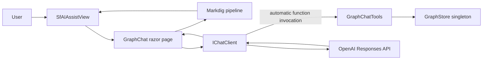
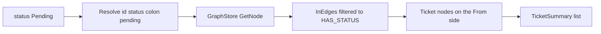
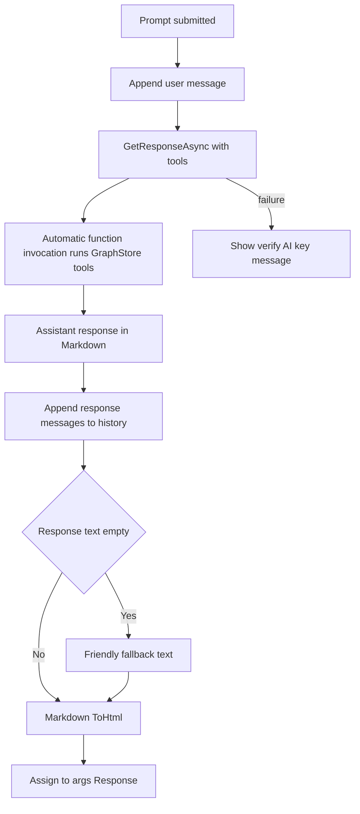

# Read-Only Graph Chat Assistant

## 1. Overview

This plan describes a read-only **Graph Chat** assistant in
`Components/Pages/GraphChat.razor`, served at `/graphchat`. The application
already has a singleton `GraphStore` containing **Ticket**, **TicketDetail**,
**Requester**, **Status**, and **Day** nodes, connected by **REQUESTED_BY**,
**HAS_DETAIL**, **HAS_STATUS**, and **OCCURRED_ON** edges.

The assistant answers relationship questions about this graph, such as:

- "How many tickets has this email opened?"
- "List the open tickets."
- "Show the tickets that have a status of Pending."
- "Show graph statistics."

The assistant is **strictly read-only**. Every answer is grounded in
deterministic `GraphStore` traversals exposed as tools. It must never invent
ticket IDs, email addresses, counts, statuses, or dates. The chat uses
**Microsoft.Extensions.AI** (`IChatClient` with automatic function invocation)
and Syncfusion's Blazor **SfAIAssistView** for the interface.

## 2. System Structure



## 3. ChatClientFactory

Create `Services/AI/ChatClientFactory.cs` to keep OpenAI client construction
behind `IChatClient`.

- Static `IChatClient Create(IConfiguration aiSection)`.
- Reads `ApiKey` and `Model` from the `"AI"` section, falling back to a
  `DefaultModel` constant when `Model` is absent.
- OpenAI is the only supported AI provider; there is no provider selector.
- Finishes the pipeline with
  `.AsBuilder().UseFunctionInvocation().Build()`.

### 3.1 Use the Responses API, not Chat Completions

```csharp
#pragma warning disable OPENAI001
IChatClient chatClient = new OpenAIClient(apiKey)
    .GetResponsesClient()
    .AsIChatClient(model);
#pragma warning restore OPENAI001
```

Reasoning models such as the gpt-5 family reject function tools on
`/v1/chat/completions` but accept them on `/v1/responses`. Because a
tool-calling assistant is the entire point of this feature, the Responses
endpoint is required. The Responses client is still experimental in the OpenAI
SDK, which is why `OPENAI001` is suppressed at the call site with a comment.

### 3.2 Missing key is not a startup failure

When `ApiKey` is empty, substitute a placeholder so construction does not throw.
The application and chat page load normally, and the first real request fails
with a clear authentication message the page surfaces.

### 3.3 One configuration section

```json
"AI": { "ApiKey": "", "Model": "gpt-5.6-sol" }
```

There is **no** separate `"OpenAI"` section. `Program.cs` reads `AI:ApiKey` and
`AI:Model` directly to register the Syncfusion Smart Components inference
service, and only when the key is non-empty.

## 4. Read-Only Tool Contract

Define the contract in `Services/AI/GraphTools/IGraphChatTools.cs` and implement
it in `GraphChatTools.cs`. Every method performs a deterministic `GraphStore`
traversal and carries a `[Description]` attribute so its signature becomes the
tool schema. Any method returning a list accepts a `max` argument.

The `[Description]` attributes live on the **interface**, not the
implementation, so the text the model reads and the contract the code compiles
against cannot drift apart.

| Tool | Parameters | Returns | Traversal |
| --- | --- | --- | --- |
| FindRequesterByEmail | `query`, `max` | `IList<RequesterSummary>` | Scans `NodesOfType("Requester")`, case-insensitive contains on the email |
| CountTicketsForRequester | `email` | `int` | Resolves `requester:<email>`, counts `InEdges` of type REQUESTED_BY |
| ListTicketsForRequester | `email`, `status`, `max` | `IList<TicketSummary>` | REQUESTED_BY `InEdges` of the requester, optionally filtered by status |
| **ListTicketsByStatus** | `status`, `max` | `IList<TicketSummary>` | Resolves `status:<status>`, walks its **incoming HAS_STATUS edges** back to Tickets |
| **ListStatuses** | (none) | `IList<StatusSummary>` | Every Status node, with its incoming HAS_STATUS edge count |
| ListDetailsForTicket | `ticketId`, `max` | `IList<CommentSummary>` | HAS_DETAIL `OutEdges` of the ticket |
| SearchNodes | `query`, `type`, `max` | `IList<NodeSummary>` | Filters nodes by id, label, **or Data value**, optional type filter |
| GetNode | `id` | `NodeDetail` | `GraphStore.GetNode(id)` |
| GetNeighbors | `id`, `edgeType`, `max` | `IList<Neighbor>` | `OutEdges` and `InEdges`, optionally filtered by edge type |
| Stats | (none) | `GraphStats` | Node and edge counts by type |

### 4.1 DTOs

Declared in `Services/AI/GraphTools/GraphChatDtos.cs`:

```csharp
public sealed record NodeSummary(string Id, string Type, string Label);
public sealed record NodeDetail(string Id, string Type, string Label,
    IReadOnlyDictionary<string, string?> Data);
public sealed record Neighbor(string EdgeType, string Direction,
    string NodeId, string NodeType, string NodeLabel);
public sealed record TicketSummary(string Id, string Label, string? Status,
    string? TicketDate, string? RequesterEmail);
public sealed record CommentSummary(string Id, string? Snippet, string? Date);
public sealed record RequesterSummary(string Id, string Email, string Label);
public sealed record StatusSummary(string Id, string Status, int TicketCount);
public sealed record GraphStats(int TotalNodes, int TotalEdges,
    IReadOnlyDictionary<string, int> NodesByType,
    IReadOnlyDictionary<string, int> EdgesByType);
```

### 4.2 Why ListTicketsByStatus exists

> **A missing tool becomes a false statement about the data.**

An earlier version of this feature had no global status filter. The only
status-aware tool was `ListTicketsForRequester`, which requires an email
address. Asked *"show the tickets that have a status of Pending"*, the model had
no tool that fit, fell back to `SearchNodes`, and got nothing — because
`SearchNodes` matched only node ids and labels, and a ticket's status lives in
its `Data` dictionary and on its `HAS_STATUS` edge.

The assistant then answered:

> There are no tickets with a status of Pending in the system.

Six Pending tickets existed. Nothing in the pipeline was lying; the model
reported an empty tool result faithfully. The gap was that no tool could express
the question, and an empty result was indistinguishable from "the search does
not look there."

Three changes close it:

1. `ListTicketsByStatus` gives the question a tool.
2. `ListStatuses` lets the model check whether a status exists before denying
   it.
3. `SearchNodes` now also matches `Data` values, and says so in its description.

### 4.3 Implement it as a traversal, not a scan

`ListTicketsByStatus(status, max)` resolves `status:<status lowercased>`, then
walks that node's **incoming HAS_STATUS edges** back to the Ticket nodes:



This is an O(1) dictionary lookup followed by a short walk, the same shape as
the REQUESTED_BY traversal `ListTicketsForRequester` already performs.

Do **not** implement it by scanning every Ticket node and comparing
`Data["status"]`. The relationship is already indexed as an edge; walking it is
the entire reason the graph exists. A scan would also drift from the edge if the
two ever disagreed.

If the status node does not exist, return an empty list rather than throwing.
`ListStatuses` is what distinguishes "no such status" from "no tickets".

## 5. System Prompt

`Services/AI/GraphTools/GraphSystemPrompt.cs` exposes a constant `Text` prompt
describing the node and edge types, the `<type>:<key>` id conventions, and the
available tools. Grounding rules:

- Derive every number from tool results; never guess counts, IDs, dates, or
  statuses.
- Resolve people with `FindRequesterByEmail` **before** looking up tickets.
- Prefer purpose-built tools over the generic `SearchNodes`/`GetNode`.
- Explicitly say when a tool returns no result.
- Keep answers concise while naming the tickets or requesters found.

Plus three rules that exist because of the false negative in section 4.2:

- To answer any question about tickets with a particular status, call
  `ListTicketsByStatus`. **Never** use `SearchNodes` to look for a status.
- Before stating that no tickets have a given status, call `ListStatuses` to
  confirm the status exists at all. If it is not in that list, say the status
  does not exist rather than that no tickets have it.
- When a list comes back with exactly `max` entries, say the result was
  truncated and give the true total from `ListStatuses` or
  `CountTicketsForRequester`.

## 6. GraphChat.razor Page

- `@page "/graphchat"`, `@rendermode InteractiveServer`.
- `@inject IChatClient ChatClient`, `@inject IGraphChatTools GraphTools`.
- Wrapped in `<AuthorizeView>`; anonymous visitors get a sign-in message.
- Hosts an `SfAIAssistView` with `PromptSuggestions` and a `PromptRequested`
  handler.
- Maintains a `List<ChatMessage>` history seeded with a `System` message
  containing `GraphSystemPrompt.Text`.

> **Every prompt suggestion must be answerable by a registered tool.** The
> suggestion "List the open tickets." shipped in an earlier version that had no
> tool capable of answering it. If a suggestion is offered, a tool must exist
> that answers it.

### 6.1 The ChatMessage name collision

`Syncfusion.Blazor.InteractiveChat` also defines a `ChatMessage`, so add:

```razor
@using ChatMessage = Microsoft.Extensions.AI.ChatMessage
```

### 6.2 The request cycle

1. Append the user message to history.
2. Call `ChatClient.GetResponseAsync(history, new ChatOptions { Tools = GraphToolRegistration.CreateTools(GraphTools) })`.
3. Append `response.Messages` to history.
4. Return `response.Text`, with a friendly fallback if empty.
5. Catch failures and tell the user to verify the OpenAI API key.

### 6.3 Rendering the model's Markdown

`SfAIAssistView` renders HTML, but the model replies in Markdown. Add **Markdig**
and convert at the edge:

```csharp
private static readonly MarkdownPipeline _markdownPipeline = new MarkdownPipelineBuilder()
    .UseAdvancedExtensions()
    .Build();

private async Task PromptRequestedAsync(AssistViewPromptRequestedEventArgs args)
{
    var responseText = await GetAssistantResponseAsync(args.Prompt);
    args.Response = Markdown.ToHtml(responseText, _markdownPipeline);
}
```

Build the pipeline once as a static field. The history stores the model's
original Markdown; only the displayed string is HTML.



## 7. Navigation Link

Add a **Graph Assistant** link inside the `<Authorized>` block in
`Components/Layout/NavMenu.razor`, and a matching
`.bi-chat-dots-fill-nav-menu` rule in `NavMenu.razor.css` using the same
embedded-SVG background pattern as the other `.bi-*-nav-menu` rules, so the icon
renders instead of an empty box.

## 8. Program.cs Wiring

```csharp
builder.Services.AddSingleton<IChatClient>(sp =>
    ChatClientFactory.Create(builder.Configuration.GetSection("AI")));
builder.Services.AddScoped<IGraphChatTools, GraphChatTools>();
```

> **Do not use `AddScoped` here.** The singleton lifetime is required, not
> preferred.

Syncfusion's `SyncfusionAIService` is registered as a singleton, and in ASP.NET
Core a singleton cannot consume a scoped service. Registering `IChatClient` as
scoped makes the application throw at start-up:

```text
Cannot consume scoped service 'Microsoft.Extensions.AI.IChatClient' from singleton
'Syncfusion.Blazor.SmartComponents.SyncfusionAIService'.
```

The singleton lifetime is safe because the client holds no per-request state and
is thread-safe. The general rule: a singleton consumer forces every dependency it
touches to be a singleton or a transient, never a scoped service.

| Service | Lifetime | Why |
| --- | --- | --- |
| `IChatClient` | **Singleton** | Consumed by the singleton `SyncfusionAIService`; stateless and thread-safe |
| `IGraphChatTools` | Scoped | Consumed per request by the chat page only |
| `GraphStore` | Singleton | Holds the loaded graph for the process |
| `HelpDeskGraphBuilder` | Scoped | Consumes a database context |

## 9. Acceptance Criteria

Phrased as observable behaviour, not as a list of files to create.

- Every factual statement is backed by a tool result, with no fabricated IDs,
  counts, statuses, or dates.
- **Asking "show the tickets that have a status of Pending" returns the actual
  Pending tickets.** It must not answer that none exist while Pending tickets are
  present in `graph.json`. Verify against the real data before considering the
  feature done.
- **Asking "list the open tickets" works without supplying an email address.**
- **Every string in `PromptSuggestions` can be answered by a registered tool.**
- A question about a person resolves the email with `FindRequesterByEmail`
  first, then reports tickets.
- Asking for a status that does not exist says so, rather than reporting that no
  tickets have it.
- "Show graph statistics" returns node and edge counts from `Stats()`.
- A reply containing a Markdown list or table renders as a real list or table.
- The application starts and serves its first page without a
  dependency-injection lifetime exception.
- With no API key, the page renders and shows a clear error after a prompt.
- The sidebar shows the Graph Assistant link with its chat-dots icon.
- The assistant remains strictly read-only; no tool mutates the graph.
