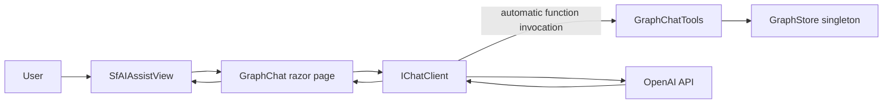
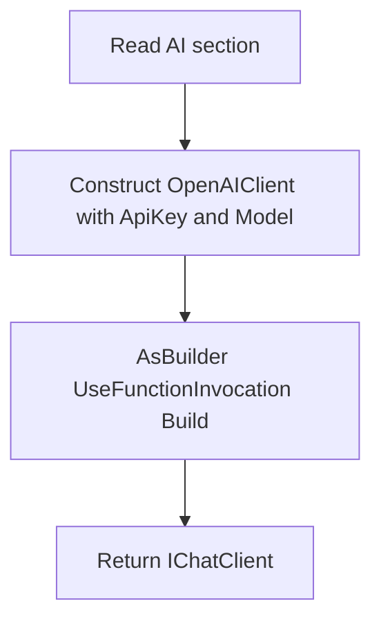
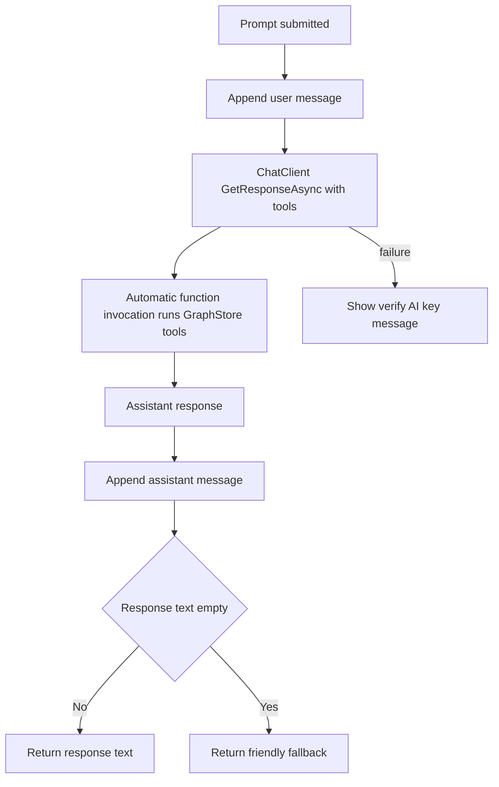

# Read-Only Graph Chat Assistant

## 1. Overview

This plan describes a read-only **Graph Chat** assistant in
`Components/Pages/GraphChat.razor`, served at `/graphchat`. The application
already has a singleton `GraphStore` containing **Ticket**, **TicketDetail**,
**Requester**, **Status**, and **Day** nodes, connected by **REQUESTED_BY**,
**HAS_DETAIL**, **HAS_STATUS**, and **OCCURRED_ON** edges.

The assistant answers relationship questions about this graph, such as:

- "How many tickets has this email opened?"
- "List the open tickets."
- "Show graph statistics."

The assistant is **strictly read-only**. Every answer is grounded in
deterministic `GraphStore` traversals exposed as tools. It must never invent
ticket IDs, email addresses, counts, statuses, or dates. The chat uses
**Microsoft.Extensions.AI** (`IChatClient` with automatic function invocation)
and Syncfusion's Blazor **SfAIAssistView** for the interface.

## 2. System Structure



## 3. ChatClientFactory

Create `Services/AI/ChatClientFactory.cs` to keep OpenAI client construction
behind `IChatClient`.

- Static `IChatClient Create(IConfiguration aiSection)`.
- Constructs `OpenAIClient` using `ApiKey` and `Model` from the `"AI"`
  section, with a sensible default model when `Model` is absent.
- OpenAI is the only supported AI provider; there is no provider selector.
- Finishes the pipeline with
  `.AsBuilder().UseFunctionInvocation().Build()` so tool calls are handled
  automatically during a chat request.

Configuration notes:

- A configured API key is **not** a startup requirement. The application and
  chat page must still load when the key is empty; an attempted request then
  fails with a clear authentication message surfaced by the page.
- The new `"AI"` configuration section is **separate** from the existing
  `"OpenAI"` section used by Syncfusion Smart Components.



## 4. Read-Only Tool Contract

Define the contract in `Services/AI/GraphTools/IGraphChatTools.cs` and implement
it in `GraphChatTools.cs`. Every method performs a deterministic `GraphStore`
traversal and carries a `[Description]` attribute so its signature becomes the
tool schema. Any method returning a list accepts a `max` argument to keep
results from flooding the model's context window.

| Tool | Parameters | Returns | Traversal |
| --- | --- | --- | --- |
| FindRequesterByEmail | `query`, `max` | `IList<RequesterSummary>` | Scans `NodesOfType("Requester")`, case-insensitive contains on the email key |
| CountTicketsForRequester | `email` | `int` | Resolves `requester:<email>`, counts `InEdges` of type REQUESTED_BY |
| ListTicketsForRequester | `email`, `status`, `max` | `IList<TicketSummary>` | REQUESTED_BY `InEdges` of the requester, optionally filtered by HAS_STATUS status |
| ListDetailsForTicket | `ticketId`, `max` | `IList<CommentSummary>` | HAS_DETAIL `OutEdges` of the ticket to TicketDetail nodes |
| SearchNodes | `query`, `type`, `max` | `IList<NodeSummary>` | Filters nodes by label/id contains, optional type filter |
| GetNode | `id` | `NodeDetail` | `GraphStore.GetNode(id)` |
| GetNeighbors | `id`, `edgeType`, `max` | `IList<Neighbor>` | `OutEdges` and `InEdges` of the node, optionally filtered by edge type |
| Stats | (none) | `GraphStats` | Counts nodes by type and edges by type from `GraphStore` |

All eight tools are read-only. They return focused DTOs (`NodeSummary`,
`NodeDetail`, `Neighbor`, `TicketSummary`, `CommentSummary`,
`RequesterSummary`, `GraphStats`) rather than raw graph nodes or database rows.

### 4.1 Tool Registration

In `Services/AI/GraphTools/GraphToolRegistration.cs`, add a static
`IList<AITool> CreateTools(IGraphChatTools tools)` that wraps every method with
`AIFunctionFactory.Create` and returns the list.

## 5. System Prompt

`Services/AI/GraphTools/GraphSystemPrompt.cs` exposes a constant `Text` prompt.
It explains the graph's node and edge types, the ID conventions
(`<type>:<key>`), and the available tools. The grounding rules instruct the
model to:

- Derive every number from tool results (never guess counts, IDs, dates, or
  statuses).
- Resolve people with `FindRequesterByEmail` **before** looking up tickets.
- Prefer purpose-built tools (for example `CountTicketsForRequester`,
  `ListTicketsForRequester`) over the generic `SearchNodes`/`GetNode` tools.
- Explicitly say when a tool returns no result.
- Keep answers concise while naming the tickets or requesters it found.

## 6. GraphChat.razor Page

- `@page "/graphchat"`, `@rendermode InteractiveServer`.
- `@inject IChatClient ChatClient`, `@inject IGraphChatTools GraphTools`.
- Hosts an `SfAIAssistView` with several `PromptSuggestions` (for example the
  three example questions) and a `PromptRequested` handler.
- Maintains a `List<ChatMessage>` history initialized with a `System` message
  containing `GraphSystemPrompt.Text`.

Per submitted prompt:

1. Append the user message to history.
2. Call `ChatClient.GetResponseAsync(history, new ChatOptions { Tools = GraphToolRegistration.CreateTools(GraphTools) })`.
3. Append the assistant response to history.
4. Return `response.Text` (supply a friendly fallback if the text is empty).
5. Catch request failures and tell the user to verify the OpenAI API key in the
   `"AI"` configuration section.



## 7. Navigation Link

Add a **Graph Assistant** link to the left sidebar inside the `<Authorized>`
block in `Components/Layout/NavMenu.razor`:

```razor
<div class="nav-item px-3">
    <NavLink class="nav-link" href="graphchat">
        <span class="bi bi-chat-dots-fill-nav-menu" aria-hidden="true"></span> Graph Assistant
    </NavLink>
</div>
```

Add a matching `.bi-chat-dots-fill-nav-menu` rule to `NavMenu.razor.css` (using
the same embedded-SVG background pattern as the other `.bi-*-nav-menu` rules) so
the chat icon renders instead of an empty box.

## 8. Program.cs Wiring

- Register the chat client:
  `builder.Services.AddScoped<IChatClient>(sp => ChatClientFactory.Create(builder.Configuration.GetSection("AI")));`
- Map the tools: `builder.Services.AddScoped<IGraphChatTools, GraphChatTools>();`

## 9. Acceptance Criteria

- Every factual statement in an answer is backed by a tool result, with no
  fabricated IDs, counts, statuses, or dates.
- A question about a person resolves the email with `FindRequesterByEmail`
  first, then reports tickets.
- "Show graph statistics" returns node and edge counts from `Stats()`.
- With no API key configured, the page still renders and shows a clear error
  after a prompt is submitted.
- The sidebar shows the Graph Assistant link with its chat-dots icon visibly
  rendered.
- The assistant remains strictly read-only; no tool mutates the graph.
