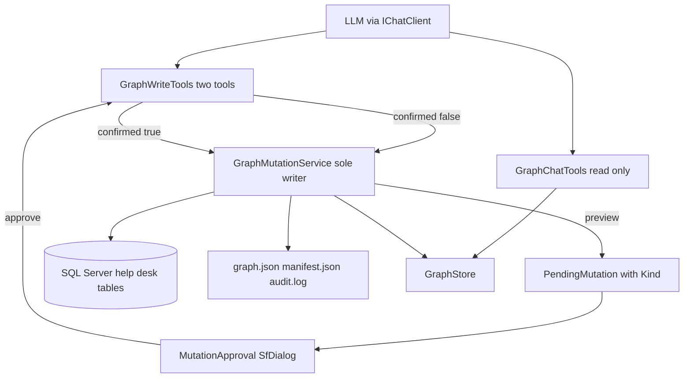
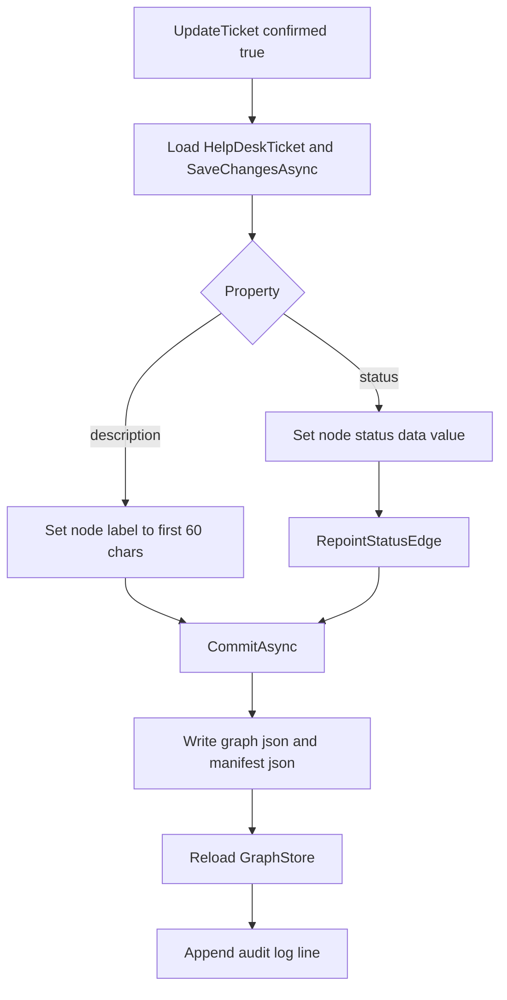
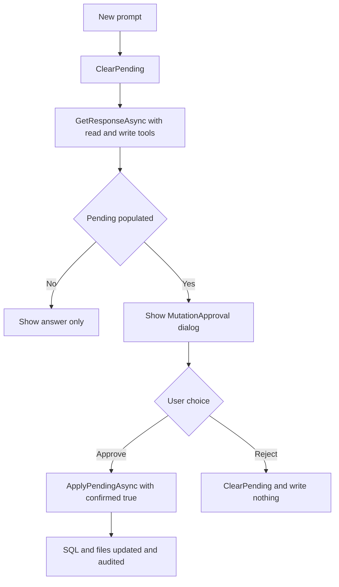

# Graph Chat with Controlled Mutations

## 1. Overview

This plan extends the read-only Graph Chat assistant with a controlled write
path. The assistant may now **propose** a change, but nothing is applied until a
person reviews a preview and clicks Approve, and every applied change is
recorded in an audit log.

At this stage the application already has a file-based graph under
`App_Data/graph`, a `GraphStore` that keeps it in memory, and a `/graphchat`
page that answers questions through deterministic `Microsoft.Extensions.AI`
tools.

## 2. Two Kinds of Change

The two write paths differ in where the truth lives.

| | Ticket edit | Knowledge-layer edit |
| --- | --- | --- |
| System of record | SQL Server | `graph.json` |
| Tool | `UpdateTicket` | `UpdateNodeContent` |
| Targets | `Ticket` nodes only | `KnowledgeArticle`, `Resolution` |
| Editable fields | `status`, `description` | any `Data` property, or `label` |
| Write order | SQL first, then mirror into the graph | graph only |

**Ticket edits.** The SQL database remains the system of record for tickets, so
the change is written to SQL first and only then mirrored into the graph.
Exactly two ticket fields may change: `status` and `description`. Nothing else
about a `Ticket` may be edited, and `TicketDetail`, `Requester`, `Status`, and
`Day` nodes stay strictly read-only. No database-derived node may be created or
deleted through this feature.

**Knowledge-layer edits.** An optional graph-native layer has no database behind
it at all: `KnowledgeArticle` and `Resolution` nodes, plus `LINKED_TO`
(Ticket to Ticket), `REFERENCES_ARTICLE` (Ticket to KnowledgeArticle), and
`RESOLVED_BY` (Ticket to Resolution) edges. These exist only in `graph.json`.

## 3. System Structure



## 4. Two-Phase Mutation Semantics

Every mutation uses the same contract:
`MutationResult Name(args, bool confirmed = false)`.

- **confirmed = false (preview only):** the operation writes nothing, to SQL or
  to disk. It returns a `MutationResult` whose `Preview` contains a
  plain-language summary, the files that would be affected, and any validation
  warnings.
- **confirmed = true (apply):** the operation applies the change, rebuilds the
  graph indexes, updates the manifest, appends an audit entry, and returns the
  resulting state.

## 5. Supported Operations and Validation Rules

| Mutation | Effect | Validation rules |
| --- | --- | --- |
| UpdateTicket | Change a ticket's `status` or `description` in SQL, then mirror into the graph | Node must exist and be a `Ticket`; property must be `status` or `description`; a status must match `HelpDeskStatusData.Statuses` case-insensitively; a description must not be blank; the id must parse as `ticket:<number>` |
| UpdateNodeContent | Update one `Data` property (or the label) of an editable node | Target must not be a read-only database-derived node; never creates or deletes a node, never alters an edge |
| LinkTickets | Add a LINKED_TO edge Ticket to Ticket | Reject self-links; reject duplicates in either direction; both endpoints must be existing `Ticket` nodes |
| AddKnowledgeArticle | Create a KnowledgeArticle node | New graph-native node only; assigns a stable graph-native id |
| ReferenceArticle | Add a REFERENCES_ARTICLE edge Ticket to KnowledgeArticle | Reject duplicates; endpoints must exist with the expected types |
| RecordResolution | Create a Resolution node and its RESOLVED_BY edge | Ticket endpoint must exist; new node and edge are graph-native |
| DeleteArticle | Remove an article and its incoming edges | Reject while REFERENCES_ARTICLE edges still point to it, unless `cascade` is true |

General rule: every new edge requires existing endpoints of the expected types.

## 6. Mutation Models

`Services/Graph/MutationModels.cs`:

- `MutationStatus` enum: `Rejected`, `PreviewOnly`, `Applied`.
- `MutationPreview`: `Summary`, `AffectedFiles`, `Warnings`.
- `MutationResult`: `Status`, `Preview`, `Errors`, with static factory helpers
  `Rejected`, `PreviewOnly`, and `Applied`.

## 7. GraphMutationService (sole writer)

`Services/Graph/GraphMutationService.cs` is the **only** component allowed to
write graph files.

- Protect the write path with a `static SemaphoreSlim WriteGate`. It must be
  static, because the service itself is registered as scoped and a new instance
  exists per request; a static gate serializes writes process-wide.
- Keep a `ReadOnlyNodeTypes` set containing `Ticket`, `TicketDetail`,
  `Requester`, `Status`, and `Day`, used by `UpdateNodeContent` and the
  knowledge-layer mutations.
- Keep a separate `EditableTicketProperties` set containing `status` and
  `description`, used only by `UpdateTicket`.
- Inject `IDbContextFactory<SyncfusionHelpDeskContext>` so `UpdateTicket` can
  reach the database.
- Work from a `GraphDocument` freshly loaded from disk rather than the one held
  in `GraphStore`, so a rejected or preview-only call can never leave the
  in-memory graph half-changed.

### 7.1 CommitAsync

The shared tail of every applied mutation:

1. Write `graph.json` atomically (temp file, then `File.Move` with overwrite).
2. Write `manifest.json` with the new `lastMutationUtc`.
3. Call `GraphStore.ReloadAsync` to rebuild the in-memory indexes.
4. Append one tab-separated line to `audit.log`: the UTC timestamp in round-trip
   format, then a detail string such as
   `UpdateTicket id=ticket:42 property=status`.

### 7.2 UpdateTicket

`UpdateTicket(ticketId, propertyName, value, confirmed, ct)` is the only
mutation that leaves the graph files, so its order of operations matters.

Validate in this order, returning `MutationResult.Rejected` at the first
failure:

1. A node with `ticketId` exists.
2. Its `Type` is `Ticket`.
3. `propertyName` is `status` or `description`.
4. If the property is `status`, the value matches one of
   `HelpDeskStatusData.Statuses` compared case-insensitively. The rejection
   message must list the valid statuses.
5. If the property is `description`, the value is not blank.
6. The node id parses as `ticket:<number>`, so the database key can be
   recovered.

Build the preview and return it when `confirmed` is false. Only after
confirmation:

1. Load the `HelpDeskTicket` by the recovered key, set `TicketStatus` or
   `TicketDescription`, and call `SaveChangesAsync`. If the row has since
   disappeared, reject.
2. Mirror the change into the loaded `GraphDocument` **in place**.
3. Call `CommitAsync`.



### 7.3 Why mirror instead of rebuild

Do **not** call `HelpDeskGraphBuilder.BuildAsync` to pick up a ticket edit. A
full rebuild derives the graph from the database alone, so it would discard the
entire knowledge layer: articles, resolutions, and links exist only in
`graph.json` and have no database rows behind them. Mirroring the single changed
field in place keeps both layers intact.

For a description change, set the node label to the first 60 characters of the
new text, matching `HelpDeskGraphBuilder`'s truncation rule, so a mirrored edit
and a rebuilt node produce the same label.

### 7.4 RepointStatusEdge

A private helper that moves a ticket's `HAS_STATUS` edge:

1. Compute the target id as `status:<newStatus lowercased>`.
2. If no node with that id exists, create the `Status` node. This happens when
   no ticket currently holds that status.
3. Remove every `HAS_STATUS` edge whose `From` is the ticket.
4. Add the new `HAS_STATUS` edge from the ticket to the status node.

Known limitation to state in the plan: when the last ticket moves off a status,
the now-unreferenced `Status` node is left behind. It is harmless, and the next
full rebuild removes it, because the builder only emits statuses it finds on
tickets.

## 8. The Write Tools

`Services/AI/GraphTools/IGraphWriteTools.cs` and `GraphWriteTools.cs` expose
exactly **two** write capabilities to the model:

- `UpdateNodeContent(nodeId, propertyName, value)` for the knowledge layer.
- `UpdateTicket(ticketId, propertyName, value)` for tickets.

The service supports the full mutation domain, but the model never sees
`LinkTickets`, `AddKnowledgeArticle`, `ReferenceArticle`, `RecordResolution`, or
`DeleteArticle`. From where the model sits, it cannot create or delete a node,
and it cannot add, change, or remove an edge. The structure of the graph is
fixed; only contents change.

Each `[Description]` must state what the tool can change, name the valid
statuses for `UpdateTicket`, say that `UpdateTicket` writes to the SQL database
and mirrors into the graph, say that database-derived nodes are otherwise
read-only, and say that calling the tool only produces a preview that a human
must approve.

### 8.1 The approval boundary is enforced by the class

Both model-invoked methods hard-code `confirmed: false` and stash the result:

```csharp
public sealed record PendingMutation(
    MutationKind Kind,
    string NodeId,
    string PropertyName,
    string Value,
    MutationPreview Preview);

public enum MutationKind { NodeContent, Ticket }
```

The `Kind` discriminator exists because there are now two writers to dispatch
to. `ApplyPendingAsync` is the **only** place in the codebase that passes
`confirmed: true`, and it switches on `Kind`:

```csharp
var result = pending.Kind switch
{
    MutationKind.Ticket => await _service.UpdateTicket(
        pending.NodeId, pending.PropertyName, pending.Value, confirmed: true, ct),
    _ => await _service.UpdateNodeContent(
        pending.NodeId, pending.PropertyName, pending.Value, confirmed: true, ct),
};
```

The interface also exposes `Pending` and `ClearPending()`. The strongest thing a
confused or adversarially prompted model can do is leave a proposal sitting in
`Pending`.

### 8.2 Tool registration

Add a `GraphToolRegistration.CreateTools(read, write)` overload that appends
both write tools to the eight read-only traversal tools.

## 9. System Prompt Changes

Update `GraphSystemPrompt` to describe the optional knowledge layer, both write
tools, and the valid ticket statuses. State the boundary from both directions:
the model **may** update an existing `Ticket`'s status or description with
`UpdateTicket`, and it must **never** claim to create or delete `Ticket`,
`TicketDetail`, `Requester`, `Status`, or `Day` nodes. Instruct the model to use
a write tool only when the user has clearly requested a change, and to report
the tool result exactly.

## 10. The Approval Dialog

`Components/Shared/MutationApproval.razor` is a modal Syncfusion `SfDialog` that
displays the `MutationPreview` summary, affected files, and warnings, with
Approve and Reject buttons. Parameters: `Visible`, `VisibleChanged`, `Preview`,
`OnApprove`, `OnReject`.

Dismissing the dialog with the close icon is treated as a **rejection**, so no
file can change without an explicit approval. The component knows nothing about
graphs, tools, or files; it takes a preview and two callbacks and nothing more.

## 11. GraphChat.razor Wiring

- Call `ClearPending()` before each turn, so a stale proposal from an earlier
  turn cannot be approved by accident.
- After the model's response returns, check `IGraphWriteTools.Pending`. When it
  is populated, set the preview and show the approval dialog.
- Call `ApplyPendingAsync()` only from the approve callback.
- Call `ClearPending()` from the reject callback.



## 12. Program.cs Wiring

```csharp
builder.Services.AddScoped<GraphMutationService>();
builder.Services.AddScoped<IGraphWriteTools, GraphWriteTools>();
```

Build the chat tool list with `GraphToolRegistration.CreateTools(read, write)`
while preserving the approval boundary above.

## 13. Acceptance Criteria

- A preview call (`confirmed == false`) writes nothing to disk and nothing to
  SQL.
- No change is applied until the human clicks Approve.
- Rejecting, or closing the dialog with the close icon, leaves every file and
  the database unchanged.
- Updating a ticket's status changes `TicketStatus` in SQL, updates the node's
  `status` value, and repoints the `HAS_STATUS` edge.
- Updating a ticket's description changes `TicketDescription` in SQL and
  re-truncates the node label to 60 characters.
- An invalid status is rejected with a message naming the valid statuses.
- An attempt to edit a `TicketDetail`, `Requester`, `Status`, or `Day` node is
  rejected.
- An applied ticket edit does not discard existing knowledge-layer nodes or
  edges.
- Every applied mutation writes `graph.json` and `manifest.json` atomically and
  appends exactly one line to `audit.log`.
