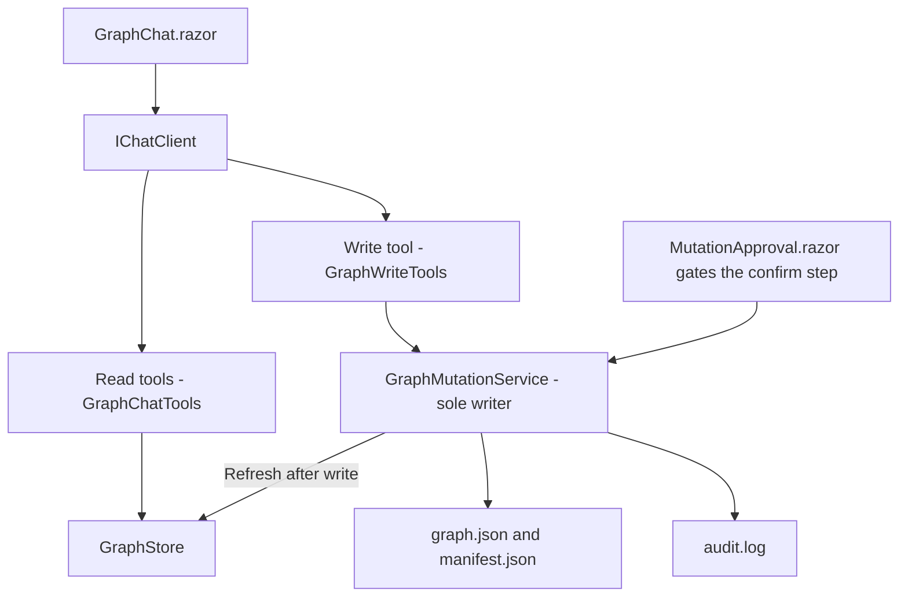
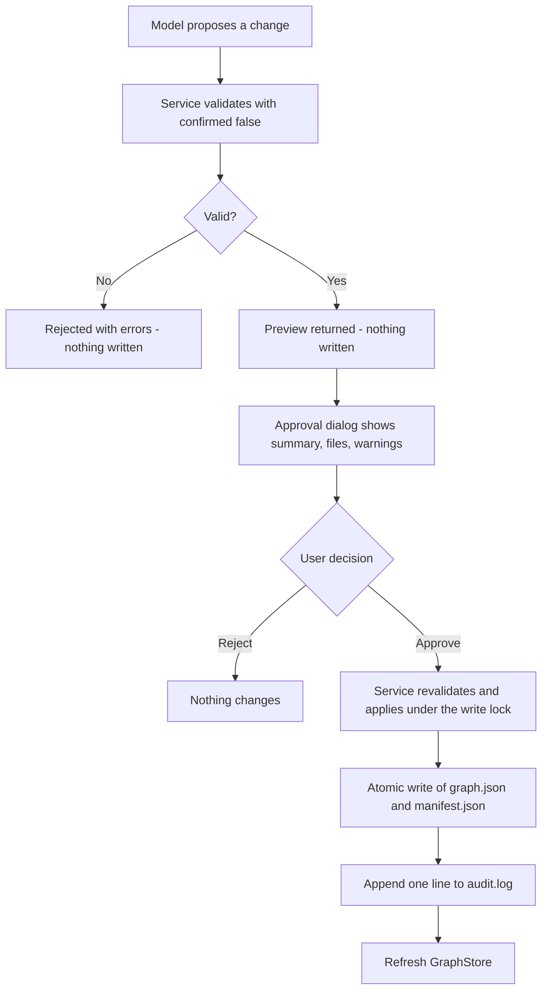

# Graph Chat with Mutations Implementation Plan

## 1. Overview

This plan extends the read-only chat at `/graphchat` with the ability to CHANGE the graph, but only through a controlled, audited, two-phase path that a human must approve. It also introduces an optional "knowledge layer" of graph-native nodes and edges that do not come from the database. The database-derived facts stay read-only while the curated knowledge layer can be edited safely.

## 2. Deliverables

| File | Purpose |
|---|---|
| `specs/mutations.md` | The mutation tool set and validation rules (authored, reviewed, committed) |
| `Services/Graph/MutationModels.cs` | `MutationStatus`, `MutationPreview`, `MutationResult` |
| `Services/Graph/GraphMutationService.cs` | The sole writer of the graph files |
| `Services/AI/GraphTools/IGraphWriteTools.cs` | The single-write-tool contract |
| `Services/AI/GraphTools/GraphWriteTools.cs` | Exposes `UpdateNodeContent` to the model |
| `Services/AI/GraphTools/GraphToolRegistration.cs` (edit) | `CreateTools(read, write)` overload |
| `Services/AI/GraphTools/GraphSystemPrompt.cs` (edit) | Describe the knowledge layer and the single write tool |
| `Components/Shared/MutationApproval.razor` | The modal approval dialog |
| `Components/Pages/GraphChat.razor` (edit) | Preview-then-approve wiring |
| `Program.cs` (edit) | DI registration |

## 3. The Extended Knowledge Domain (graph-native, not from the database)

- New node types: `KnowledgeArticle` (id `article:<guid>`; props title, summary) and `Resolution` (id `resolution:<guid>`; props summary, resolvedDate).
- New edge types: `LINKED_TO` (Ticket -> Ticket), `REFERENCES_ARTICLE` (Ticket -> KnowledgeArticle), `RESOLVED_BY` (Ticket -> Resolution).
- These are the only things that may be created, edited, or deleted. The database-derived nodes (Ticket, TicketDetail, Requester, Status, Day) remain strictly read-only: a rebuild would overwrite any change to them, so every mutation that targets them is rejected.

## 4. The Mutations Specification (`specs/mutations.md`)

Every mutation tool has the signature pattern:

```csharp
MutationResult Name(args, bool confirmed = false);
```

Two-phase semantics:

- `confirmed == false`: the tool changes NOTHING. It validates and returns a `MutationResult` whose `Preview` holds a human-readable summary, the list of files that would change, and any validation warnings.
- `confirmed == true`: the tool applies the change, rebuilds the store indexes, updates the manifest, appends to the audit log, and returns the post-change state.

The tool set and its validation rules:

| Mutation | Effect | Validation rules |
|---|---|---|
| `LinkTickets(fromTicketId, toTicketId)` | Add a LINKED_TO edge | Reject a duplicate in either direction; reject self-links |
| `AddKnowledgeArticle(title, summary)` | Create a KnowledgeArticle node | Title required |
| `ReferenceArticle(ticketId, articleId)` | Add a REFERENCES_ARTICLE edge | Reject if the edge already exists |
| `RecordResolution(ticketId, summary)` | Create a Resolution node plus a RESOLVED_BY edge | Ticket must exist |
| `DeleteArticle(articleId, cascade)` | Remove an article and its incoming edges | Reject while a REFERENCES_ARTICLE still points to it unless `cascade == true` |
| `UpdateNodeContent(nodeId, propertyName, value)` | Set one Data property, or the label when propertyName is "label" | Node must exist and must not be a read-only type |

Global rules: both endpoints of any new edge must exist and be of the expected type; mutations targeting database-derived node properties are rejected.

## 5. The Mutation Models (`Services/Graph/MutationModels.cs`)

```csharp
public enum MutationStatus { Rejected, PreviewOnly, Applied }

public sealed class MutationPreview
{
    public string Summary { get; set; } = "";
    public List<string> AffectedFiles { get; set; } = new();
    public List<string> Warnings { get; set; } = new();
}

public sealed class MutationResult
{
    public MutationStatus Status { get; set; }
    public MutationPreview? Preview { get; set; }
    public List<string> Errors { get; set; } = new();

    public static MutationResult Rejected(IEnumerable<string> errors) => ...;
    public static MutationResult PreviewOnly(MutationPreview preview) => ...;
    public static MutationResult Applied(MutationPreview preview) => ...;
}
```

## 6. The Single Writer (`GraphMutationService`)

- The ONLY component allowed to write the graph files. Guard writes with a `SemaphoreSlim(1, 1)` so two mutations cannot interleave.
- Keep a `ReadOnlyNodeTypes` set (Ticket, TicketDetail, Requester, Status, Day) and reject any mutation that targets them.
- Each public mutation follows the two-phase pattern in section 4. On confirm, a private `ApplyAsync` path: load `graph.json` into an in-memory `GraphDocument`, apply the mutation delegate, write `graph.json` and `manifest.json` atomically (temp file then move), append one line to `audit.log` (`timestampUtc | operation | summary`), and refresh `GraphStore`.
- `UpdateNodeContent(nodeId, propertyName, value, confirmed)` sets one `Data` property of an existing node, or its `Label` when `propertyName == "label"`. It never creates or deletes nodes and never touches edges, and rejects read-only nodes.

## 7. The Chat Write Tool (`IGraphWriteTools` / `GraphWriteTools`)

- Expose exactly ONE write capability to the model: `UpdateNodeContent(nodeId, propertyName, value)`, delegating to `GraphMutationService` with `confirmed = true` only after human approval.
- The `[Description]` must make clear this is the only permitted change, that it cannot create or delete nodes or edges, and that database-derived nodes are read-only.
- Extend `GraphToolRegistration` with an overload `CreateTools(IGraphChatTools read, IGraphWriteTools write)` that adds the write tool alongside the read-only traversal tools.
- Update `GraphSystemPrompt` to describe the optional knowledge layer and the single write tool, instructing the model to change a node's contents only when the user clearly asks, and to report exactly what the tool returns.

## 8. The Approval UI (`Components/Shared/MutationApproval.razor`)

- A Syncfusion `SfDialog` (modal) that shows the `MutationPreview` (the summary, the list of affected files, and any warnings) with Approve and Reject buttons.
- Parameters: `Visible` / `VisibleChanged`, `Preview`, `OnApprove`, `OnReject`.
- Wire `GraphChat.razor` so a proposed change first produces a preview (`confirmed = false`), displays the approval dialog, and only calls the mutation with `confirmed = true` when the user approves. On reject, nothing is written.

## 9. Dependency Injection (`Program.cs`)

- Register `GraphMutationService` (scoped) and `IGraphWriteTools -> GraphWriteTools`.
- Pass both the read and write tools into the chat's tool list via the `CreateTools(read, write)` overload.

## 10. Main-Menu Integration

This feature extends the existing `/graphchat` page, so the "Graph Assistant" sidebar link and its icon were already added with the read-only chat; no new menu item is required. If the entry is not yet present, add it in `Components/Layout/NavMenu.razor` and, because this template does NOT load a Bootstrap Icons web font, also add the matching inline SVG data-URI class `.bi-chat-dots-fill-nav-menu` to `Components/Layout/NavMenu.razor.css` so the icon renders instead of showing an empty box. Never emit a `<span class="bi bi-...">` that has no matching data-URI rule in `NavMenu.razor.css`.

## 11. System Structure



## 12. Process Flow: The Two-Phase Commit



## 13. Acceptance Criteria

- A preview call (`confirmed == false`) never writes to disk.
- No change is applied until the human clicks Approve in the dialog.
- Database-derived nodes cannot be edited; such attempts are rejected with a clear message.
- Duplicate LINKED_TO and REFERENCES_ARTICLE edges are rejected; DeleteArticle is rejected while an article is still referenced unless cascade is set.
- Every applied mutation writes `graph.json` and `manifest.json` atomically and appends one line to `audit.log`.
