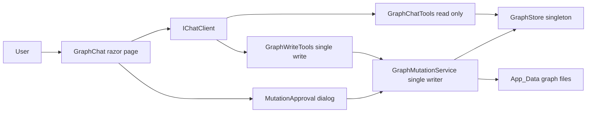
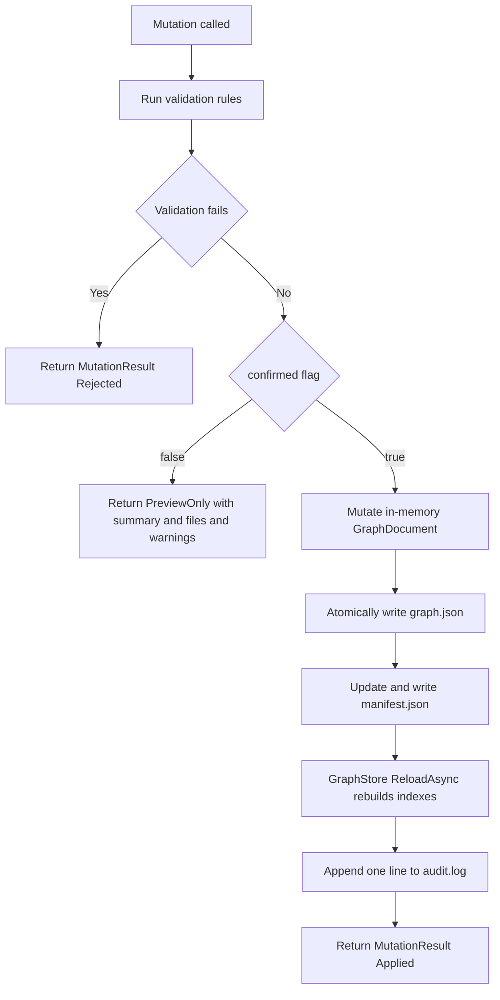
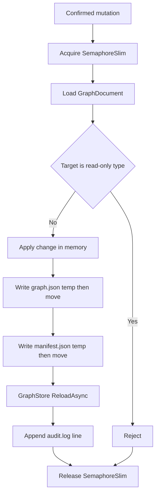
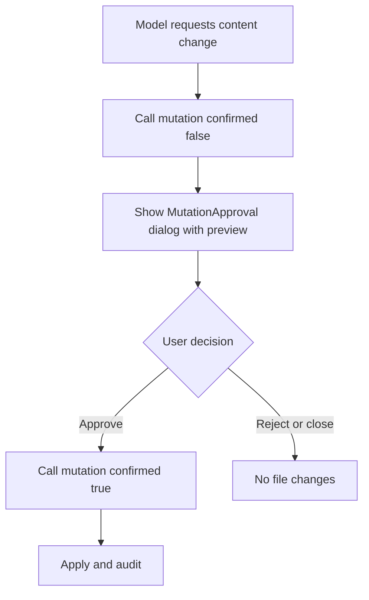

# Graph Chat With Controlled Mutations

## 1. Overview

This plan extends the existing read-only **Graph Chat** assistant with a
carefully controlled mutation path. At this stage the application already has a
file-based graph under `App_Data/graph`, a `GraphStore` that keeps it in memory,
and a read-only `/graphchat` page that uses Microsoft.Extensions.AI tools for
deterministic queries.

The assistant may now **propose** changes, but no proposal is applied until a
person has reviewed a **preview** and explicitly approved it. Every applied
change is auditable.

### Read-Only Boundary

All facts derived from the database stay read-only. **Ticket**, **TicketDetail**,
**Requester**, **Status**, and **Day** nodes cannot be created, changed, or
deleted through this feature.

### Graph-Native Knowledge Layer

An optional, graph-native knowledge layer is introduced. Only these nodes and
edges may be managed by mutations:

- **KnowledgeArticle** node
- **Resolution** node
- **LINKED_TO** edge (Ticket -> Ticket)
- **REFERENCES_ARTICLE** edge (Ticket -> KnowledgeArticle)
- **RESOLVED_BY** edge (Ticket -> Resolution)

## 2. System Structure



## 3. Two-Phase Mutation Semantics

Every mutation uses the same contract:

```csharp
MutationResult Name(args, bool confirmed = false);
```

- **confirmed = false (preview only):** the operation writes nothing. It returns
  a `MutationResult` whose `Preview` contains a plain-language summary, the files
  that would be affected, and any validation warnings.
- **confirmed = true (apply):** the operation applies the change, rebuilds the
  graph indexes, updates the manifest, appends an audit entry, and returns the
  resulting state.



## 4. Supported Operations and Validation Rules

| Mutation | Effect | Validation rules |
| --- | --- | --- |
| LinkTickets | Add a LINKED_TO edge Ticket -> Ticket | Reject self-links; reject duplicates in either direction; both endpoints must be existing Ticket nodes |
| AddKnowledgeArticle | Create a KnowledgeArticle node | New graph-native node only; assigns a stable graph-native id |
| ReferenceArticle | Add a REFERENCES_ARTICLE edge Ticket -> KnowledgeArticle | Reject duplicates; ticket must be an existing Ticket, article an existing KnowledgeArticle |
| RecordResolution | Create a Resolution node and its RESOLVED_BY edge Ticket -> Resolution | Ticket endpoint must exist; new Resolution node and edge are graph-native |
| DeleteArticle | Remove an article and its incoming edges | Reject while REFERENCES_ARTICLE edges still point to it, unless `cascade` is true |
| UpdateNodeContent | Update one `Data` property (or the label) of an editable node | Target must not be a read-only database-derived node; never creates or deletes a node, never alters an edge |

General rules:

- Every new edge requires existing endpoints of the expected types.
- Any attempt to modify a database-derived node property is rejected.

## 5. Mutation Models

Place shared models in `Services/Graph/MutationModels.cs`.

```csharp
public enum MutationStatus { Rejected, PreviewOnly, Applied }

public class MutationPreview
{
    public string Summary { get; set; } = "";
    public IList<string> AffectedFiles { get; set; } = new List<string>();
    public IList<string> Warnings { get; set; } = new List<string>();
}

public class MutationResult
{
    public MutationStatus Status { get; set; }
    public MutationPreview? Preview { get; set; }
    public IList<string> Errors { get; set; } = new List<string>();

    public static MutationResult Rejected(params string[] errors);
    public static MutationResult PreviewOnly(MutationPreview preview);
    public static MutationResult Applied(MutationPreview preview);
}
```

The factory helpers are named `Rejected`, `PreviewOnly`, and `Applied`.

## 6. GraphMutationService (single writer)

`Services/Graph/GraphMutationService.cs` is the **only** component allowed to
write graph files.

- Protect the write path with a `SemaphoreSlim` so concurrent mutations cannot
  interleave.
- Keep a `ReadOnlyNodeTypes` set containing `Ticket`, `TicketDetail`,
  `Requester`, `Status`, `Day`, and use it to reject forbidden targets
  consistently.

Every public method follows the same preview-and-confirm flow. Once confirmed,
the service:

1. Works from an in-memory `GraphDocument` (loaded via `GraphFile`).
2. Applies the change to that document.
3. Atomically writes `graph.json` and `manifest.json` through a temporary file
   and `File.Move` with overwrite.
4. Calls `GraphStore.ReloadAsync` to rebuild indexes.
5. Appends one line to `audit.log`.



### UpdateNodeContent

`UpdateNodeContent(nodeId, propertyName, value, confirmed)`:

- Updates one `Data` property on an existing **editable** node.
- When `propertyName` is `"label"`, it updates the node's label instead.
- Must never create or delete a node, alter an edge, or modify a read-only node
  (rejected via `ReadOnlyNodeTypes`).

## 7. Single Write Tool Exposed to the Model

Although the service supports the full mutation domain, expose exactly **one**
write tool to the AI model.

- Define `IGraphWriteTools` and `GraphWriteTools` in `Services/AI/GraphTools`.
- The only model-visible write capability is
  `UpdateNodeContent(nodeId, propertyName, value)`.
- It delegates to `GraphMutationService` and may pass `confirmed = true` only
  **after human approval**.
- Its `[Description]` must explain that this is the sole permitted edit, that it
  cannot create or delete nodes or edges, and that database-derived nodes remain
  read-only.

### Tool Registration and System Prompt

- Add a `GraphToolRegistration.CreateTools(read, write)` overload that combines
  this one write tool with the existing read-only traversal tools.
- Update `GraphSystemPrompt` to describe the optional knowledge layer and
  `UpdateNodeContent`, instructing the model to use it only when the user has
  clearly requested a content change and to report the tool result exactly.

## 8. MutationApproval Component

Create `Components/Shared/MutationApproval.razor` as a modal Syncfusion
`SfDialog`.

- Displays the `MutationPreview` summary, affected files, and warnings.
- Offers **Approve** and **Reject** buttons.
- Parameters: `Visible`, `VisibleChanged`, `Preview`, `OnApprove`, `OnReject`.

Approval boundary in `GraphChat.razor`:

- Always request a preview with `confirmed = false` before showing the dialog.
- Call the confirmed mutation (`confirmed = true`) **only** from the approval
  callback (`OnApprove`).
- Rejecting or closing the proposal must leave every file unchanged.



## 9. Program.cs Wiring

- Register the mutation service as **scoped**:
  `builder.Services.AddScoped<GraphMutationService>();`
- Map the write tool:
  `builder.Services.AddScoped<IGraphWriteTools, GraphWriteTools>();`
- Build the chat tool list with **both** the read and write tool sets using the
  `CreateTools(read, write)` overload, while preserving the approval boundary
  (preview first, confirmed only after human approval).

## 10. Acceptance Criteria

- A mutation with `confirmed = false` writes nothing and returns a preview with
  summary, affected files, and warnings.
- A mutation with `confirmed = true` applies the change, rebuilds indexes,
  updates the manifest, appends exactly one audit line, and returns `Applied`.
- LinkTickets rejects self-links and duplicates in either direction.
- ReferenceArticle rejects duplicates; every new edge requires existing
  endpoints of the expected types.
- DeleteArticle is rejected while REFERENCES_ARTICLE edges point to the article
  unless `cascade` is true.
- Any attempt to modify a database-derived node (Ticket, TicketDetail,
  Requester, Status, Day) is rejected via `ReadOnlyNodeTypes`.
- `UpdateNodeContent` changes only one property or the label of an editable
  node and never touches nodes or edges otherwise.
- Only `GraphMutationService` writes graph files, and concurrent mutations
  cannot interleave (SemaphoreSlim).
- The model sees exactly one write tool; approvals gate every applied change,
  and rejecting leaves all files unchanged.
